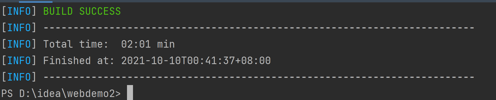

[toc]
---
# spring boot 入门

## spring boot简介

spring boot带来了全新的自动化配置解决方案，使用spring boot可以快速创建基于spring生产级的独立用用程序。spring boot中对一些常用的第三方库提供了默认的自动化配置方案，只需要很少的配置就能运行一个完整的javaEE应用，spring boot项目可以采用传统的方式打包成war包，部署到tomcat中运行，也可以打包成可以直接运行的jar包。

**优点**
- 快速spring项目搭建渠道
- 少量配置即可运行一个javaEE项目
- 提供生产级的服务监控方案
- 内嵌服务器，可快速部署
- 提供一系列非功能性的通用配置
- 纯java配置，无代码生成，也没有xml配置

## spring boot程序

### 创建maven工程

**Windows 安装配置maven教程**

下载地址：
```url
https://archive.apache.org/dist/maven/maven-3/
```

解压到自定义的目录后，创建一个仓库问文件夹

找到同级目录下的conf文件夹，打开，打开settings.xml
配置本地仓库

切换阿里源

配置环境变量

更新path

测试
```
mvn --version
```


**1.使用命令创建maven工程**
```
mvn archetype:generate -DgroupId=com.zcz.webdemo2 -DartifactId=webdemo2 -DarchetypeArtifactId=maven-archetype-webapp -DinteractiveMode=false

-DarchetypeArtifactId：模板名称
-DgroupId：输入的groupId
-DartifactId：输入的artifactId
-DinteractiveMode=false：不以交互式命令行的形式构建项目
```
```
注意：
在powershell中运行命令会报错，记得参数加引号
```


**2.intelliJ IDEA创建maven项目**
选择maven，next

填写项目名称、项目位置，点击完成


### 项目构建
**添加依赖**
在pom.xml中添加spring-boot-starter-parent作为partent
```java
    <parent>
        <groupId>org.springframework.boot</groupId>
        <artifactId>spring-boot-starter-parent</artifactId>
        <version>2.0.3.RELEASE</version>
    </parent>
```
spring-boot-starter-parent提供了一些maven的默认配置，同时提供了dependency-management，这样，在引入其他依赖时不必输入版本号，为方便依赖管理，spring boot中提供的starter非常多，这些starter主要为第三方库提供自动配置，例如开发web项目，就引入一个web的starter：
```java
    <dependencies>
        <dependency>
            <groupId>org.springframework.boot</groupId>
            <artifactId>spring-boot-starter-web</artifactId>
        </dependency>
    </dependencies>
```
**编写启动类**
在java目录下创建项目包，在创建一个类：
```java
package org.example;
import org.springframework.boot.SpringApplication;
import org.springframework.boot.autoconfigure.SpringBootApplication;

@SpringBootApplication
public class App {
    public static void main(String[] args) {
        SpringApplication.run(App.class, args);
    }
}
```
@SpringBootApplication 注解，就是说项目中添加了spring-boot-starter-web依赖，会自动进行spring和spring MVC的配置

创建spring MVC中的控制器-HelloController.java
```java
package org.example;

import org.springframework.web.bind.annotation.GetMapping;
import org.springframework.web.bind.annotation.RestController;

@RestController
public class HelloController {
    @GetMapping("/hello")
    public String hello() {
        return "hello spring boot!";
    }
}
```
在控制器中提供了一个hello接口

### 项目启动
**main**
直接运行main方法

浏览器访问http://localhost:8080/hello


**maven命令启动**
当前终端下，运行
```
mvn spring-boot:run
```
浏览器访问http://localhost:8080/hello

**打包启动**
要将spring boot打包成jar包运行，需要在pom.xml中添加plugin
```java
<build>
        <plugins>
            <plugin>
                <groupId>org.springframework.boot</groupId>
                <artifactId>spring-boot-maven-plugin</artifactId>
            </plugin>
        </plugins>
    </build>
```
然后运行
```
mvn package
```
在target目录下会生成一个jar文件，

运行命令
```java
java -jar jar文件
```
浏览器访问http://localhost:8080/hello

## 简便创建spring boot

### IntelliJ IDEA 创建

创建项目时选择spring initializr，输入项目基本信息，下一步


选择依赖，之后intellij IDEA会自动把依赖添加到pom.xml中


点击完成，项目创建成功。