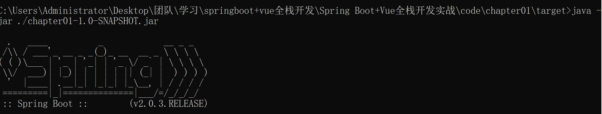

[toc]
---
# spring boot 基础配置

## 不使用spring-boot-starter-parent
spring-boot-starter-parent提供的默认配置有：
- java版本1.8
- 编码格式utf-8
- 提供dependency management进行项目依赖的版本管理
- 默认的资源过滤于插件配置

在开发多模块项目时，一般需要使用公司自己的parent，用dependency management实现，在pom.xml中添加：
```java
    <dependencyManagement>
        <dependencies>
            <dependency>
                <groupId>org.springframework.boot</groupId>
                <artifactId>spring-boot-dependencies</artifactId>
                <version>2.0.3.RELEASE</version>
                <type>pom</type>
                <scope>import</scope>
            </dependency>
        </dependencies>
    </dependencyManagement>
```
此时不用继承spring-boot-starter-parent，但是java版本、编码格式等需要手动配置。

java版本配置，添加一个plugin：
```java
            <plugin>
                <groupId>org.apache.maven.plugins</groupId>
                <artifactId>maven-compiler-plugin</artifactId>
                <version>3.1</version>
                <configuration>
                    <source>1.8</source>
                    <target>1.8</target>
                </configuration>
            </plugin>
```

编码格式，如果是快捷创建项目则默认会加上，不然在pom.xml中加入：
```java
    <properties>
        <project.build.sourceEncoding>UTF-8</project.build.sourceEncoding>
        <project.reporting.outputEncoding>UTF-8</project.reporting.outputEncoding>
    </properties>
```

## @spring bootapplication注解
@spring bootapplication是一个组合注解

1. @spring bootconfiguration。表明这是一个配置类，可以再这个类中配置bean
2. @enableautoconfiguration。表示开启自动化配置，但是并不是入侵式的，表示可以在任何时刻进行手动配置代替
3. @componentscan。完成包扫描。@componentscan默认扫描的类都在当前类所在的包下面

可以创建一个新的类用来专门配置bean，这样更便于bean的管理

@componentscan注解，可以扫面@services、@repository、@component、@controller、@restcontroller、@configuration等注解的类

## 定制banner

spring boot项目在启动时会自动打印一个banner



在resources目录下创建一个banner.txt文档，在文档中写入的文本将在项目启动的时候打印出来，将TXT文本设置成艺术体，参考：
- http://www.network-science.de/ascii/
- http://www.kammerl.de/ascii/AsciiSignature.php
- http://patorjk.com/software/taag


关闭banner，修改启动类中的main方法:
```java
    public static void main(String[] args) {
	SpringApplicationBuilder builder = new SpringApplicationBuilder(Chapter012Application.class);
	builder.bannerMode(Banner.Mode.OFF).run(args);
}
```
## web容器配置
### tomcat配置
**常规配置**
tomcat默认作为web容器，对tomcat作进一步配置，在application.properties中进行配置
```java
server.port=8081  web容器端口号
server.error.path=/error  当项目出错时跳转去的页面
server.servlet.session.timeout=1  session失效时间
server.servlet.context-path=/chapter02  项目名称，不配置是默认为/
server.tomcat.uri-encoding=utf-8  tomcat请求编码
server.tomcat.max-threads=500  tomcat最大线程数
server.tomcat.basedir=/home/sang/tmp  存放tomcat运行日志和临时文件的目录
```

**https配置**
在jdk中提供了一个java数字证书管理工具keytool，在jdk/bin目录下，通过工具生成一个数字证书，命令：
```
keytool -genkey -alias tomcathttps -keyalg RSA -keysize 2048 -keystore exsample.p12 -validity 365
```
- -genkey:表示要创建一个新的密钥
- -keyalg：使用的加密算法是RSA
- -alias：keystore的别名
- -keysize：密钥长度
- -keystore：生成密钥存放的位置
- -validity：密钥的有效时间

命令执行完成后，会在当前目录下生成一个名为exsample.p12的文件，将这个文件复制到根目录下，然后在application.properties中配置：
```java
server.ssl.key-store=sang.p12
server.ssl.key-alias=tomcathttps
server.ssl.key-store-password=123456
#server.ssl.key-store-type=PKCS12
```
- key-store:密钥文件名
- key-alias：密钥别名
- key-store-password：在cmd命令执行过程中输入的密码

启动项目，在浏览器输入https://localhost:8080/chapter02/hello，会遭到拦截，点击继续前往，即可成功访问

如果蚁http的方式访问接口，则会访问失败，因为spring boot不支持在配置中同时启动http和https，可以配置将http请求重定向为https请求
配置方式如下：
```java
package com.example.demo5.config;

import org.apache.catalina.Context;
import org.apache.catalina.connector.Connector;
import org.apache.tomcat.util.descriptor.web.SecurityCollection;
import org.apache.tomcat.util.descriptor.web.SecurityConstraint;
import org.springframework.boot.web.embedded.tomcat.TomcatServletWebServerFactory;
import org.springframework.context.annotation.Bean;
import org.springframework.context.annotation.Configuration;

@Configuration
public class TomcatConfig {
    @Bean
    TomcatServletWebServerFactory tomcatServletWebServerFactory() {
        TomcatServletWebServerFactory factory = new TomcatServletWebServerFactory(){
            @Override
            protected void postProcessContext(Context context) {
                SecurityConstraint constraint = new SecurityConstraint();
                constraint.setUserConstraint("CONFIDENTIAL");
                SecurityCollection collection = new SecurityCollection();
                collection.addPattern("/*");
                constraint.addCollection(collection);
                context.addConstraint(constraint);
            }
        };
        factory.addAdditionalTomcatConnectors(createTomcatConnector());
        return factory;
    }
    private Connector createTomcatConnector() {
        Connector connector = new Connector("org.apache.coyote.http11.Http11NioProtocol");
        connector.setScheme("http");
        connector.setPort(8080);
        connector.setSecure(false);
        connector.setRedirectPort(8081);
        return connector;
    }
}

```
首先配置一个TomcatServletWebServerFactory，然后再添加一个tomcat中的Connector，监听8080端口，将请求转发到8081上去

浏览器输入
http://localhost:8080/demo5/hello
会自动跳转到
https://localhost:8081/demo5/hello

### jetty配置
除了tomcat外也可以在spring boot中嵌入jetty，配置方式如下：
```java
<dependency>
    <groupId>org.springframework.boot</groupId>
    <artifactId>spring-boot-starter-jetty</artifactId>
</dependency>
```

### Undertow配置
Undertow配置是一个红帽公司的开源java服务器
配置方式：
```java
<dependency>
    <groupId>org.springframework.boot</groupId>
    <artifactId>spring-boot-starter-undertow</artifactId>
</dependency>
```

### properties配置

承载自定义配置的文件是recourse目录下的application.properties文件

application.properties配置文件一共可以出现的位置
- 1. 项目根目录下的config文件夹中
- 2. 项目的根目录下
- 3. classpath下的config文件夹中
- 4. classpath下

如果四个位置都有，优先级为1,2,3,4

如果不想使用application.properties作为配置文件名，也可以自己定义，比如，在recourse文件夹下新建一个配置文件app.properties，然后将项目打包成jar包，打包成功后，使用如下命令运行
```
java -jar ----.jar --spring.config.name=app
```
使用spring.config.location可以指定配置文件所在的目录
```
java -jar ----.jar --spring.config.name=app --spring.config.location=classpath:/
```

### 类型安全配置属性
所有的配置最终都会加载到spring environment中，spring提供了@value注解以及environmentAwvre接口来将spring environment中的数据注入到属性上，spring boot提出了类型安全配置属性（type-safe configuration properties），即使在数据量非常庞大的情况下，也可以更加方便的将配置文件中的数据注入bean中
在application properties中添加
```java
book.name=三国演义
book.author=罗贯中
book.price=30
```
将配置数据注入到bean中：
```java
@Component
@ConfigurationProperties("book")
public class Book {
    private String name;
    private String author;
    private Float price;

    @Override
    public String toString() {
        return "Book{" +
                "name='" + name + '\'' +
                ", author='" + author + '\'' +
                ", price=" + price +
                '}';
    }

    public String getName() {
        return name;
    }

    public void setName(String name) {
        this.name = name;
    }

    public String getAuthor() {
        return author;
    }

    public void setAuthor(String author) {
        this.author = author;
    }

    public Float getPrice() {
        return price;
    }

    public void setPrice(Float price) {
        this.price = price;
    }
}
```
创建BookController进行测试
```java
@RestController
public class BookController {
    @Autowired
    Book book;
    @GetMapping("/book")
    public String book(){
        return book.toString();
    }
}
```
运行项目，访问http://localhost:8080/book


### YAML配置
YAML是json的超极，简介且强大，在创建spring boot项目时，引入的spring-boot-starter-web依赖间接的引入了snakeyaml依赖，snakeyaml依赖会实现对yaml的配置和解析，在spring boot项目中使用yaml只需要在recourse目录下创建一个application.yaml文件即可，然后再application.yaml中加入如下配置：
```yaml
server:
  port: 80
  servlet:
    context-path: /demo1
  tomcat:
    uri-encoding: utf-8
```
等价于在application.properties中配置：
```java
server-port:80
server.servlet.context-path=/demo1
server.tomcat.url-encoding=utf-8
```
此时可以将recourse目录下的application.properties文件删除，完全使用yaml完成文件的配置

### 复杂配置
yaml同时可以配置复杂属性：
```yaml
my:
  name:123
  address:456
```
和properties配置文件一样，这一段配置也可以注入到一个bean中：
```java
@Component
@ConfigurationProperties(prefix="my")
public class Book {
    private String name;
    private String address;
```

yaml还支持列表的配置：
```yaml
my:
    name: 江南一点雨
    address: China
    favorites:
    - 足球
    - 徒步
    - Coding
```
配置也可以注入到一个bean中：
```java
@Component
@ConfigurationProperties(prefix="my")
public class Book {
    private String name;
    private String address;
    private List<String> favorites
```

yaml还支持更复杂的配置，即集合中也可以是一个对象，例如
```yaml
my:
  users:
    - name: 江南一点雨
      address: China
      favorites:
        - 足球
        - 徒步
        - Coding
    - name: sang
      address: GZ
      favorites:
        - 阅读
        - 吉他
```
这组配置在集合中放的是一个对象，因此也可以注入到如下集合中：
```java
@Component
@ConfigurationProperties(prefix = "my")
public class Users {
    private List<User> users;
}
```
yaml存在的缺陷：
无法使用@properties注解加载yaml文件，如果项目中有这种需求，还是要使用properties形式的配置文件

### profile配置
为了防止在项目发布前频繁的在开发环境、配置环境中进行测试，更改大量的配置，所以spring boot中约定在不同环境下的配置文件名称及规则为application-{profile}.properties，占位符{profile}表示当前环境的名称，配置步骤如下：
- 创建配置文件
在recourse目录下创建两个配置文件：application-dev.properties和application-prod.properties分别表示开发环境和生产环境中的配置，其中application-dev.properties的内容如下：
```
sever.port:8080
```
application-prod.properties的内容如下：
```
server.port:80
```
- 配置application.properties
```
spring.profiles.active=dev
```
配置表示以application-dev.properties配置文件启动项目，另外一个类推

- 代码中配置
除了在application.properties中配置，也可以在代码中配置
```java
SpringApplicationBuilder builder = new SpringApplicationBuilder(Demo1Application.class);
builder.application().setAdditionalProfiles("dev");
builder.run(args);
```
- 启动项目时配置
甚至可以在项目启动的时候进行配置(打包成jar包后)：
```
java -jar ----.jar --spring.profile.active=pord
```
