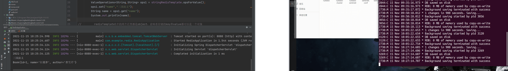
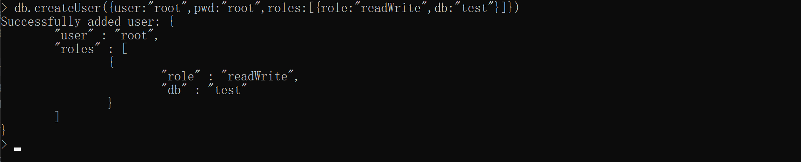
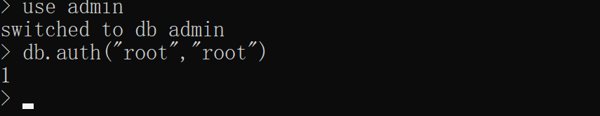
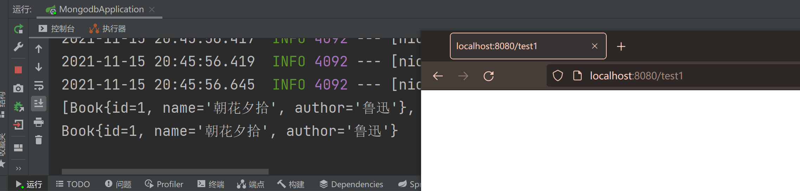
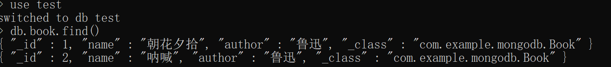

# spring boot整合NoSQL

## spring boot整合redis

redis是一个key-value存储系统,支持存储的value类型相对更多，包括string(字符串)、list(链表)、set(集合)、zset(sorted set --有序集合)和hash（哈希类型）。这些数据类型都支持push/pop、add/remove及取交集并集和差集及更丰富的操作，而且这些操作都是原子性的。

在 Spring Boot 中，默认集成的 Redis 就是 Spring Data Redis，默认底层的连接池使用了 lettuce ，Spring Data Redis 针对 Redis 提供了非常方便的操作模板 RedisTemplate 。

spring boot整合redis步骤如下：

**1.创建spring boot项目**

创建spring boot项目，添加如下依赖：

```xml
        <dependency>
            <groupId>org.springframework.boot</groupId>
            <artifactId>spring-boot-starter-data-redis</artifactId>
        </dependency>
        <dependency>
            <groupId>org.springframework.boot</groupId>
            <artifactId>spring-boot-starter-web</artifactId>
        </dependency>
        <dependency>
            <groupId>org.apache.commons</groupId>
            <artifactId>commons-pool2</artifactId>
        </dependency>
```

主要就是引入了 Spring Data Redis + 连接池

**2.配置redis**

```properties
spring.redis.database=0
spring.redis.password=
spring.redis.port=6379
spring.redis.host=192.168.152.154
spring.redis.lettuce.pool.min-idle=5
spring.redis.lettuce.pool.max-idle=10
spring.redis.lettuce.pool.max-active=8
spring.redis.lettuce.pool.max-wait=1ms
spring.redis.lettuce.shutdown-timeout=100ms
```

到这里自动化配置已经生效

自动化配置中提供了两个bean，RedisTemplate 和 StringRedisTemplate ，其中 StringRedisTemplate 是 RedisTemplate 的子类，两个的方法基本一致，不同之处主要体现在操作的数据类型不同，RedisTemplate 中的两个泛型都是 Object ，意味者存储的 key 和 value 都可以是一个对象，而 StringRedisTemplate 的 两个泛型都是 String ，意味者 StringRedisTemplate 的 key 和 value 都只能是字符串。

**controller**

```java
@RestController
public class BookController {
    @Autowired
    RedisTemplate redisTemplate;
    @Autowired
    StringRedisTemplate stringRedisTemplate;
    @GetMapping("/test1")
    public void test1(){
//        StringRedisTemplate中的两个泛型都是String,意味着存储的key和value只能是String
//        ValueOperations<String,String> ops1 = stringRedisTemplate.opsForValue();
//        ops1.set("name","三国演义");
//        String name = ops1.get("name");
//        System.out.println(name);

//        redisTemplatel中的两个泛型都是object，意味着存储的key和value都可以是一个对象
        ValueOperations ops2 = redisTemplate.opsForValue();
        Book b1 = new Book();
        b1.setId(1);
        b1.setName("红楼梦");
        b1.setAuthor("曹雪芹");
        ops2.set("b1", b1);
        Book book = (Book) ops2.get("b1");
        System.out.println(book);
    }
}
```

要缓存的 Java 对象必须实现 Serializable 接口，因为 Spring 会将对象先序列化再存入 Redis,所以我这里的一个解决办法是将实体类继承Serializable

```java
public class Book implements Serializable {
    private Integer id;
    private String name;
    private String author;

    public Integer getId() {
        return id;
    }

    public void setId(Integer id) {
        this.id = id;
    }

    public String getName() {
        return name;
    }

    public void setName(String name) {
        this.name = name;
    }

    public String getAuthor() {
        return author;
    }

    public void setAuthor(String author) {
        this.author = author;
    }

    @Override
    public String toString() {
        return "Book{" +
                "id=" + id +
                ", name='" + name + '\'' +
                ", author='" + author + '\'' +
                '}';
    }
}
```

**测试**

启动项目，访问http://localhost:8080/test1



## redis集群整合spring boot

后续补上

## 整合mangodb

mongodb是一种面向文档的数据库管理系统，是一个介于关系型数据库和非关系型数据库之间的产品。

### mongodb安装（Windows）

- https://www.mongodb.com/download-center/community

下载msi文件之后运行，基本一路下一步

### 创建数据目录

例如，已经在`C:\Program Files\MongoDB\`下安装了mongodb，创建一个 data 的目录然后在 data 目录里创建 db 目录。

```cmd
cd C:\Program Files\MongoDB\
md "\data\db"
```

### 运行mongodb服务器

```cmd
cd C:\Program Files\MongoDB\Server\5.0\bin\

mongod.exe -dbpath \data\db
```

默认情况下，启动后自动连接，MongoDB的test库，而关闭mongodb的命令需要在admin中执行

```
use admin
db.shutdownServer()
exit
```

## 安全管理

默认情况下，MongoDB启动后没有登录密码，要配置密码，首先要创建一个账户，如在admin库中创建一个账户：

```
use admin
db.createUser({user:"root",pwd:"root",roles:[{role:"readWrite",db:"test"}]})
```



然后关闭当前实例,重新启动实例

```
mongod.exe -dbpath \data\db
```

切换到admin库中经行验证

```
use admin
db.auth("root","root")
```



## 整合spring boot

**1.创建项目**

创建spring boot项目，添加web、mongodb依赖

```xml
        <dependency>
            <groupId>org.springframework.boot</groupId>
            <artifactId>spring-boot-starter-data-mongodb</artifactId>
        </dependency>
        <dependency>
            <groupId>org.springframework.boot</groupId>
            <artifactId>spring-boot-starter-web</artifactId>
        </dependency>
```

**2.配置mongodb**

```properties
spring.data.mongodb.authentication-database=admin
spring.data.mongodb.database=test
spring.data.mongodb.host=127.0.0.1
spring.data.mongodb.port=27017
spring.data.mongodb.username=root
spring.data.mongodb.password=root
```

- 验证登录信息的库为admin
- 库为test
- 主机
- 端口
- 账号密码

**3.创建实体类**

```java
public class Book {
    private Integer id;
    private String name;
    private String author;

    public Integer getId() {
        return id;
    }

    public void setId(Integer id) {
        this.id = id;
    }

    public String getName() {
        return name;
    }

    public void setName(String name) {
        this.name = name;
    }

    public String getAuthor() {
        return author;
    }

    public void setAuthor(String author) {
        this.author = author;
    }

    @Override
    public String toString() {
        return "Book{" +
                "id=" + id +
                ", name='" + name + '\'' +
                ", author='" + author + '\'' +
                '}';
    }
}
```

**4.创建BookDao**

```java
public interface BookDao extends MongoRepository<Book,Integer> {
    List<Book> findByAuthorContains(String author);
    Book findByNameEquals(String name);
}
```

**5.创建controller**

```java
@RestController

public class BookController {
    @Autowired
    BookDao bookDao;
    @Autowired
    MongoTemplate mongoTemplate;
    @GetMapping("/test1")
    public void test1(){
        List <Book> books = new ArrayList<>();
        Book b1 = new Book();
        b1.setId(1);
        b1.setName("西游记");
        b1.setAuthor("吴承恩");
        books.add(b1);
        Book b2 = new Book();
        b2.setId(2);
        b2.setName("白帽子讲web安全");
        b2.setAuthor("忘记了");
        books.add(b2);
        mongoTemplate.insertAll(books);
        List<Book> list = mongoTemplate.findAll(Book.class);
        System.out.println(list);
        Book book = mongoTemplate.findById(2,Book.class);
        System.out.println(book);
    }

    @GetMapping("/test2")
    public void test2() {
        List<Book> books = new ArrayList<>();
        Book b1 = new Book();
        b1.setId(1);
        b1.setName("朝花夕拾");
        b1.setAuthor("鲁迅");
        books.add(b1);
        Book b2 = new Book();
        b2.setId(2);
        b2.setName("呐喊");
        b2.setAuthor("鲁迅");
        books.add(b2);
        bookDao.insert(books);
        List<Book> books1 = bookDao.findByAuthorContains("鲁迅");
        System.out.println(books1);
        Book book = bookDao.findByNameEquals("朝花夕拾");
        System.out.println(book);
    }
}
```

**6.测试**

启动项目，浏览器访问http://localhost:8080/test1



切换test库，查找插入的数据



还可以使用mongoTemplate实现，代码在，controller中的test2接口。
