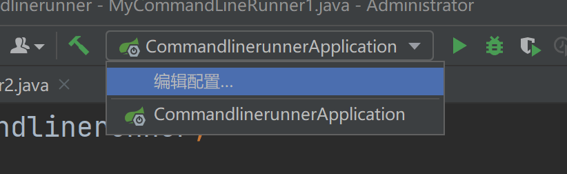

[toc]
---
# spring boot 整合web开发

## 返回json数据

### 默认实现
在默认情况下，当新建一个spring boot项目之后，添加web依赖，代码如下：
```xml
<dependency>
    <groupId>org.springframework.boot</groupId>
    <artifactId>spring-boot-starter-web</artifactId>
</dependency>
```
这个依赖默认加入了Jackson-databind作为json处理器，此时不需要添加额外的json处理器就能返回一段json了，创建一个book实体类：
```java
public class Book {
    private String name;
    private String author;
    @JsonIgnore
    private Float price;
    @JsonFormat(pattern="yyyy-MM-dd")
    private Date publicationDate;
}
```
创建bookcontroller：
```java
@Controller
public class BookController {
    @GetMapping("/book")
    @ResponseBody
    public Book book(){
        Book book = new Book();
        book.setAuthor("罗贯中");
        book.setName("三国演义");
        book.setPrice(30f);
        book.setPublicationDate(new Date());
        return book;
    }
}
```
运行项目，访问http://localhost:8080/book


### 自定义转换器
常见的json处理器除了jackson-dataqbind外，还有Gson和fastjson
#### Gson
Gson是google的一个开源json解析框架，使用Gson，首先要去除默认的jackson-databind，然后加入Gson依赖。
```xml
<dependency>
    <groupId>org.springframework.boot</groupId>
    <artifactId>spring-boot-starter-web</artifactId>
    <exclusions>
        <exclusion>
            <groupId>com.fasterxml.jackson.core</groupId>
            <artifactId>jackson-databind</artifactId>
        </exclusion>
    </exclusions>
</dependency>

<dependency>
    <groupId>com.google.code.gson</groupId>
    <artifactId>gson</artifactId>
</dependency>
```
然后就可以像使用jackson-databind一样直接使用Gson，但是在Gson对日期数据进行格式化，还需要自己定义httpmessageconverter
代码如下：
```java
@Configuration
public class GsonConfig {
   @Bean
   GsonHttpMessageConverter gsonHttpMessageConverter() {
       GsonHttpMessageConverter converter = new GsonHttpMessageConverter();
       GsonBuilder builder = new GsonBuilder();
       builder.setDateFormat("yyyy-MM-dd");
       builder.excludeFieldsWithModifiers(Modifier.PROTECTED);
       Gson gson = builder.create();
       converter.setGson(gson);
       return converter;
   }
}
```
然后将book类中的price字段的修饰符改为protect
访问地址。
#### fastjson
fastjson继承完城之后不能直接使用，需要提供对应的httpmessageconverter后才能使用，集成fastjson步骤如下：
**去除jackson-databind依赖，引入fastjson依赖**
```xml
<dependency>
    <groupId>org.springframework.boot</groupId>
    <artifactId>spring-boot-starter-web</artifactId>
    <exclusions>
        <exclusion>
            <groupId>com.fasterxml.jackson.core</groupId>
            <artifactId>jackson-databind</artifactId>
        </exclusion>
    </exclusions>
</dependency>
<dependency>
    <groupId>com.alibaba</groupId>
    <artifactId>fastjson</artifactId>
    <version>1.2.47</version>
</dependency>
```
**配置fastjson**
```java
public class FastjsonConfig {
    @Bean
    FastJsonHttpMessageConverter fastJsonHttpMessageConverter() {
        FastJsonHttpMessageConverter converter = new FastJsonHttpMessageConverter();
        FastJsonConfig config = new FastJsonConfig();
        config.setDateFormat("yyyy-MM-dd");
        config.setCharset(Charset.forName("UTF-8"));
        config.setSerializerFeatures(
                SerializerFeature.WriteClassName,
                SerializerFeature.WriteMapNullValue,
                SerializerFeature.PrettyFormat,
                SerializerFeature.WriteNullListAsEmpty,
                SerializerFeature.WriteNullStringAsEmpty
        );
        converter.setFastJsonConfig(config);
        return converter;
    }
}
```
防止返回数据乱码，可在application.properties中配置：
```xml
spring.http.encoding.force-response=true
```
访问http://localhost:8080/book


### 静态资源访问
**默认策略**
spring boot中对于spring MVC的自动化配置都在webmvcautoconfiguration类中，在webmvcautoconfiguration类中有一个静态内部类webmvcautoconfigurationadapter实现了webmvcconfigurer接口，在webmvcconfigurer接口中有一个方法addresourcehandlers是用来配置今天资源过滤的。
spring boot默认会过滤所有的静态资源，静态资源的位置一共有5个分别是"classpath://META-INF/recourse"、"classpath:/recourse"、"classpath:/static/"、"classpath:/public"、"/",可以把静态资源放在这5个位置下面的任意一个。
**自定义策略**
1. 在配置文件中定义
在application.properties中定义过滤规则和静态资源位置
```xml
spring.mvc.static-path-pattern=/static/**
spring.resources.static-locations=classpath:/static/
```
过滤规则为/static/**,静态资源位置为：classpath:/static/

2. java编码定义
```java
@Configuration
public class MyWebMvcConfig implements WebMvcConfigurer {
    @Override
    public void addResourceHandlers(ResourceHandlerRegistry registry) {
        registry
                .addResourceHandler("/static/**")
                .addResourceLocations("classpath:/static/");
    }
}
```
### 文件上传
java中文件上传一共涉及两个组件，Commonsmultipartresolver和standardservletmultipartresolver。
Commonsmultipartresolver使用commons-fileupload来处理multipart请求，而standardservletmultipartresolver则是基于servlet3.0来处理multipart请求，所以使用standardservletmultipartresolver时不需要添加额外的jar包。
#### 单文件上传
新建spring boot项目，在static目录下新建upload.html文件：
```html
<!DOCTYPE html>
<html lang="en">
<head>
    <meta charset="UTF-8">
    <title>Title</title>
</head>
<body>
<form action="/upload" method="post" enctype="multipart/form-data">
    <input type="file" name="uploadFile" value="请选择文件" multiple>
    <input type="submit" value="上传">
</form>
</body>
</html>
```
然后创建处理文件上传的接口FileUploadController.java：
```java
@RestController
public class FileUploadController {
    SimpleDateFormat sdf = new SimpleDateFormat("yyyy/MM/dd/");

    @PostMapping("/upload")
    public String upload(MultipartFile uploadFile, HttpServletRequest req) {
        //规划上传文件的保存路径为项目目录下的uploadfile文件夹，并在文件夹中通过日期对上传的文件归类保存
        String realPath = req.getSession().getServletContext().getRealPath("/uploadFile/");
        System.out.println(realPath);
        String format = sdf.format(new Date());
        File folder = new File(realPath + format);
        if (!folder.isDirectory()) {
            folder.mkdirs();
        }
        //给上传的文件重命名，避免文件重名
        String oldName = uploadFile.getOriginalFilename();
        String newName = UUID.randomUUID().toString() + oldName.substring(oldName.lastIndexOf("."), oldName.length());
        try {
            //文件保存操作
            uploadFile.transferTo(new File(folder, newName));
            //生成上传文件的访问路径，并将访问路径返回
            String filePath = req.getScheme() + "://" + req.getServerName() + ":" + req.getServerPort() + "/uploadFile/" + format + newName;
            return filePath;
        } catch (IOException e) {
//            e.printStackTrace();
        }
        return "上传失败!";
    }
}
```
访问http://localhost:8080/upload.html，选择文件上传

**扩展**
对文件上传的细节进行配置application.properties：
```xml
//是否开启文件上传支持
spring.servlet.multipart.enabled=true
//文件写入磁盘的阈值，默认为0
spring.servlet.multipart.file-size-threshold=0
//上传文件的临时保存位置
spring.servlet.multipart.location=E:\\temp
//上传的单个文件的最大大小
spring.servlet.multipart.max-file-size=1MB
//多文件上传时的总大小
spring.servlet.multipart.max-request-size=100MB
文件是否延时解析，默认为false
spring.servlet.multipart.resolve-lazily=false
```
#### 多文件上传
创建项目，在static目录下新建upload.html：
```html
<!DOCTYPE html>
<html lang="en">
<head>
    <meta charset="UTF-8">
    <title>Title</title>
</head>
<body>
<form action="/upload" method="post" enctype="multipart/form-data">
    <input type="file" name="uploadFile" value="请选择文件" multiple>
    <input type="submit" value="上传">
</form>
</body>
</html>
```
修改控制器：
```java
@PostMapping("/uploads")
    public String upload(MultipartFile[] uploadFiles, HttpServletRequest req) {
        //遍历uploadfiles数组分别存储
        for (MultipartFile uploadFile : uploadFiles) {
            String realPath = req.getSession().getServletContext().getRealPath("/uploadFile/");
            System.out.println(realPath);
            String format = sdf.format(new Date());
            File folder = new File(realPath + format);
            if (!folder.isDirectory()) {
                folder.mkdirs();
            }
            String oldName = uploadFile.getOriginalFilename();
            String newName = UUID.randomUUID().toString() + oldName.substring(oldName.lastIndexOf("."), oldName.length());
            try {
                uploadFile.transferTo(new File(folder, newName));
                String filePath = req.getScheme() + "://" + req.getServerName() + ":" + req.getServerPort() + "/uploadFile/" + format + newName;
//            return filePath;
                System.out.println(filePath);
            } catch (IOException e) {
                e.printStackTrace();
            }
        }
        return "上传失败!";
    }
```
### @ControllorAdvice
@ControllorAdvice是@Controllor的增强版，@ControllorAdvice主要用来处理全局数据。
#### 全局异常处理
@ControllorAdvice最常见的场景就是全局异常处理，比如用户上传的文件超过了限制的大小，就会抛出异常，此时可以通过@ControllorAdvice和@ExceptionHandler定义全局异常的捕获机制。
```java
@ControllerAdvice
public class CustomExceptionHandler {
    @ExceptionHandler(MaxUploadSizeExceededException.class)
    public ModelAndView uploadException(MaxUploadSizeExceededException e) throws IOException {
        ModelAndView mv = new ModelAndView();
        mv.addObject("msg", "上传文件大小超出限制!");
        mv.setViewName("error");
        return mv;
    }
}
```
然后在resources/templates目录下创建error.html文件,网页模板使用Thymeleaf
```html
<!DOCTYPE html>
<html lang="en">
<head>
    <meta charset="UTF-8">
    <title>Title</title>
</head>
<body>
<div th:text="${msg}"></div>
</body>
</html>
```
#### 添加全局数据
在@ControllorAdvice中配置全局数据
```java
@ControllerAdvice
public class GlobalConfig {
    @ModelAttribute(value = "info")
    //全局配置中添加userinfo方法，返回一个map，此时在任意请求的controllor中，通过方法参数中的model都可以获取info中的值
    public Map<String,String> userInfo() {
        HashMap<String, String> map = new HashMap<>();
        map.put("username", "罗贯中");
        map.put("gender", "男");
        return map;
    }
}
```
controllor代码：
```java
    @GetMapping("/hello")
    @ResponseBody
    public void hello(Model model) {
        Map<String, Object> map = model.asMap();
        Set<String> keySet = map.keySet();
        Iterator<String> iterator = keySet.iterator();
        while (iterator.hasNext()) {
            String key = iterator.next();
            Object value = map.get(key);
            System.out.println(key + ">>>>>" + value);
        }
    }
```
#### 请求参数预处理
@ControllerAdvice结合InitBinder实现请求参数预处理
假设有两个实体类：
```java
public class Book {
    private String name;
    private String author;

    @Override
    public String toString() {
        return "Book{" +
                "name='" + name + '\'' +
                ", author='" + author + '\'' +
                '}';
    }

    public String getName() {
        return name;
    }

    public void setName(String name) {
        this.name = name;
    }

    public String getAuthor() {
        return author;
    }

    public void setAuthor(String author) {
        this.author = author;
    }
}
```
```java
public class Author {
    private String name;
    private int age;

    @Override
    public String toString() {
        return "Author{" +
                "name='" + name + '\'' +
                ", age=" + age +
                '}';
    }

    public String getName() {
        return name;
    }

    public void setName(String name) {
        this.name = name;
    }

    public int getAge() {
        return age;
    }

    public void setAge(int age) {
        this.age = age;
    }
}
```
在controller中接收两个实体类的数据,正常定义时，参数在传递时，两个实体类中的name属性会混淆，@ControllerAdvice结合InitBinder解决这个问题
首先给controllor中方法的参数添加@ModelAttribute注解
```java
    @GetMapping("/book")
    @ResponseBody
    public String book(@ModelAttribute("b") Book book, @ModelAttribute("a") Author author) {
        return book.toString() + ">>>" + author.toString();
    }
```
然后配置@ControllerAdvice
```java
    @InitBinder("b")
    public void init(WebDataBinder binder) {
        binder.setFieldDefaultPrefix("b.");
    }
    @InitBinder("a")
    public void init2(WebDataBinder binder) {
        binder.setFieldDefaultPrefix("a.");
    }
```
第一个@InitBinder("b")表示该方法是处理@ModelAttribute("b")对应的参数
第二个@InitBinder("a")表示该方法是处理@ModelAttribute("a")对应的参数

### 自定义错误页
先略过

### cors支持
cors是由W3C制定的一种跨域资源共享技术标准，其目的就是为了解决前端的跨域请求。
spring boot中配置CORS步骤如下：
**1.创建spring boot工程**
创建spring boot项目
**2.创建控制器**
在项目中，添加一个BookControllor控制器：
```java
@RestController
@RequestMapping("/book")
public class BookControllor {
    @PostMapping("/")
    public String addBook(String name){
        return "receive:"+name;
    }
    @DeleteMapping("/{id}")
    public String deleteBook(@PathVariable long id){
        return String.valueOf(id);

    }
}
```
BookControllor提供了两个接口，一个是添加接口，一个是删除接口。
**配置跨域**
跨域有两个地方可以配置，一个是直接在相应的请求方法上加上注解：
```java
@RestController
@RequestMapping("/book")
public class BookControllor {
    @PostMapping("/")
    @CrossOrigin(value = "http://localhost:8081",maxAge = 1800,allowedHeaders = "*")
    public String addBook(String name){
        return "receive:"+name;
    }
    @DeleteMapping("/{id}")
    @CrossOrigin(value = "http://localhost:8081",maxAge = 1800,allowedHeaders = "*")
    public String deleteBook(@PathVariable long id){
        return String.valueOf(id);

    }
}
```
@CrossOrigin中value表示支持的域，这里表示来自http://localhost:8080域的请求是支持跨域的
maxAge表示探测请求的有效期
allowedHeaders表示允许的请求头，*表示所有的请求头都允许

另外一种配置是采用全局配置。
```java
@Configuration
public class MyWebMvcConfig implements WebMvcConfigurer {
    @Override
    public void addViewControllers(ViewControllerRegistry registry) {
        registry.addViewController("/user").setViewName("user");
    }
}
```
全局配置需要实现WebMvcConfigurer接口，然后实现接口中的addViewControllers方法

**测试**
新建一个index.html
```html
<!DOCTYPE html>
<html lang="en">
<head>
    <meta charset="UTF-8">
    <title>Title</title>
</head>
<body>
<div id = "contentDiv"></div>>
<div id = "deleteResult"></div>
<input type="button" value="提交数据"onclick="getData()" ><br>
<input type="button" value="删除数据"onclick="deleteData()" ><br>
<script>
    function deleteData(){
        $.ajax({
            url:"http://localhost:8080/book/99",
            type:"delete",
            success:function (msg){
                $("#deleteResult").html(msg)
            }
        })
    }
    function getData(){
        $.ajax({
            url:"http://localhost:8080/book",
            type:"post",
            data:{name:'三国演义'},
            success:function (msg){
                $("#contentDiv").html(msg)
            }
        })
    }
</script>
</body>
</html>
```
两个普通的ajax都发送了一个跨域请求
讲项目端口改为8081
```
server.port=8081
```
启动项目，测试

### 配置类与xml配置
省略，学习的时候不推荐使用xml配置，所以没有深究

### 注册拦截器
spring boot注册拦截器
**创建项目**
创建spring boot项目
**创建拦截器**
创建拦截器实现HandlerInterceptor接口：
```java
import org.springframework.web.servlet.HandlerInterceptor;
import org.springframework.web.servlet.ModelAndView;

import javax.servlet.http.HttpServletRequest;
import javax.servlet.http.HttpServletResponse;

public class MyInterceptor1 implements HandlerInterceptor {
    @Override
    public boolean preHandle(HttpServletRequest request, HttpServletResponse response,Object handler){
        System.out.println("prehandle");
        return true;
    }
    @Override
    public void postHandle(HttpServletRequest request, HttpServletResponse response, Object handler, ModelAndView modelAndView){
        System.out.println("posthandle");
    }
    @Override
    public void afterCompletion(HttpServletRequest request,HttpServletResponse response,Object handler,Exception ex){
        System.out.println("afterCompletion");
    }
}
```
拦截器建按照prehandler--controller--posthandler--aftercompletion的顺序执行

**配置拦截器**
```java
import org.springframework.web.servlet.config.annotation.InterceptorRegistry;
import org.springframework.web.servlet.config.annotation.WebMvcConfigurer;

public class WebMvcConfig implements WebMvcConfigurer {
    @Override
    public void addInterceptors(InterceptorRegistry registry){
        registry.addInterceptor(new MyInterceptor1())
                .addPathPatterns("/**")
                .excludePathPatterns("/hello");
    }
}
```
addPathPatterns:拦截路径
excludePathPatterns：排除路径

**测试**
在浏览器中提供/hello2和/hello接口
```java
import org.springframework.web.bind.annotation.GetMapping;
import org.springframework.web.bind.annotation.RestController;

@RestController
public class HelloControllor {
    @GetMapping("/hello")
    public String hello() {
        return "hello";
    }
    @GetMapping("/hello2")
    public String hello2() {
        return "hello2";
    }
}
```
启动项目，访问/hello2接口，观察控制台输出

### 启动系统任务

#### CommandLineRunner

spring boot项目在启动时会遍历所有的CommandLineRunner并调用其中的run方法，如果系统有多个CommandLineRunner的实现类，可以使用过@Order对这些实现类的调用顺序进行排序。

在一个spring boot web项目中添加两个CommandLineRunner，如下：
MyCommandLineRunner1.java
```java
@Component
@Order(1)
public class MyCommandLineRunner1 implements CommandLineRunner {
    @Override
    public void run(String... args) throws Exception {
        System.out.println("Runner1>>>"+ Arrays.toString(args));
    }
}
```
MyCommandLineRunner2.java
```java
@Component
@Order(1)
public class MyCommandLineRunner2 implements CommandLineRunner {
    @Override
    public void run(String... args) throws Exception {
        System.out.println("Runner2>>>"+ Arrays.toString(args));
    }
}
```
启动项目时，配置传入的参数，InteLLJ idea为例，配置方式如下：

1. 点击编辑启动配置



2. 再打开的页面中编辑program arguments，如果有多个参数，参数之间使用空格隔开。


3. 启动项目，启动日志打印如下：


#### ApplicationRunner

ApplicationRunner和CommandLineRunner的用法基本一致，主要区别在run方法的参数上。

在一个spring boot web项目中添加两个ApplicationRunner，如下：

```java
@Component
@Order(1)
public class MyApplicationRunner1 implements ApplicationRunner {
    @Override
    public void run(ApplicationArguments args) throws Exception {
        List<String> nonOptionArgs = args.getNonOptionArgs();
        System.out.println("1-nonOptionArgs>>>" + nonOptionArgs);
        Set<String> optionNames = args.getOptionNames();
        for (String optionName : optionNames) {
            System.out.println("1-key:" + optionName + ";value:" +
                    args.getOptionValues(optionName));
        }
    }
}
```
```java
@Component
@Order(2)
public class MyApplicationRunner2 implements ApplicationRunner {
    @Override
    public void run(ApplicationArguments args) throws Exception {
        List<String> nonOptionArgs = args.getNonOptionArgs();
        System.out.println("2-nonOptionArgs>>>" + nonOptionArgs);
        Set<String> optionNames = args.getOptionNames();
        for (String optionName : optionNames) {
            System.out.println("2-key:" + optionName + ";value:" +
                    args.getOptionValues(optionName));
        }
    }
}
```
- @Order注解依然是用来排序
- CommandLineRunner中的run方法是String数组为参数，而这里的run方法是一个ApplicationArguments对象，如果想从ApplicationArguments对象中获取入口类中main方法接受的参数，调用ApplicationArguments中的getNonOptionArgs方法即可。

之后运行`mvn package`命令对项目进行打包。
```
mvn package
```

然后进入到打包目录中，运行命令启动项目：
```
java -jar  --name=Michael --age=99 谭警官 二仙桥大爷
```


#### 整合Servlet、Filter、Listener

一般情况下，在使用spring、spring MVC框架之后，基本就告别了Servlet、Filter、Listener，有些时候在整合第三方框架的时候需要使用servlet，例如整合某报表插件。

在spring boot web中添加如下三个组件：
```java
@WebServlet("/my")
public class MyServlet extends HttpServlet {
    @Override
    protected void doGet(HttpServletRequest req, HttpServletResponse resp){
        doPost(req,resp);
    }
    @Override
    protected void doPost(HttpServletRequest req, HttpServletResponse resp){
        System.out.println("name>>>"+req.getParameter("name"));
    }
}
```
```java
@WebFilter("/*")
public class MyFiter implements Filter {
    @Override
    public void init(FilterConfig filterConfig){
        System.out.println("MyFilter>>>init");
    }
    @Override
    public void doFilter(ServletRequest request, ServletResponse response, FilterChain chain) throws IOException, ServletException {
        System.out.println("MyFilter>>>doFilter");
        try {
            chain.doFilter(request,response);
        } catch (IOException e) {
            e.printStackTrace();
        }
    }
    @Override
    public void destroy() {
        System.out.println("MyFilter>>>destroy");
    }
}
```
```java
@WebListener
public class MyListener implements ServletRequestListener {
    @Override
    public void requestDestroyed(ServletRequestEvent sre) {
        System.out.println("MyListener>>>requestDestroyed");
    }
    @Override
    public void requestInitialized(ServletRequestEvent sre) {
        System.out.println("MyListener>>>requestInitialized");
    }
}
```
在项目入口添加@ServletComponentScan注解，实现对servlet、fiter、listener的扫描。

启动项目，浏览器中输入`http://localhost:8080/my?name=Michael`,可以看到日志。


#### 路径映射

有些页面需要在控制器中加载数据，然后渲染，才能现实出来，还有一些页面不需要家在数据，只是完成简单的跳转，对于这种页面，可以直接配置路径映射，提高访问速度。

#### 配置AOP

##### AOP是什么

假设公司有一个人力管理资源系统已经上线，但是系统运行不稳定，为了检测出到底是哪一个环节出问题，开发者想监控每一个方法的执行时间，再根据这些执行时间来判断问题所在。问题的关键点在于系统已经运行，如果能在系统运行的过程中添加动态代码，就能大大提高工作效率，节省时间资源。

这种在系统运行时添加动态代码的方式称为，面向切面编程（AOP）

##### AOP基本概念

- Jionpoint（连接点）：类里面可以被增强的方法即为连接点，比如想修改那个方法中的功能，那么该方法就是一个连接点
- Pointcut（切入点）：对Jionpoint进行拦截的定义即为切入点。
- Advice（通知）：拦截到Jionpoint之后最重要的事情就是通知。通知分为前置通知、后置通知、异常通知、最终通知、环绕通知。
- Aspect（切面）：Pointcut和Advice的结合
- Target（目标）：要增强的类称为target

##### spring boot支持

spring boot在spring基础上对AOP的配置提供了自动化配置解决方案spring-boot-starter-aop。

首先在spring boot web项目中引入spring-boot-starter-aop依赖：
```xml
        <dependency>
            <groupId>org.springframework.boot</groupId>
            <artifactId>spring-boot-starter-aop</artifactId>
        </dependency>
```

接下来创建切面代码如下：
```java
@Component
@Aspect
public class LogAspect {
    @Pointcut("execution(* org.sang.aop.service.*.*(..))")
    public void pc1() {
    }
    @Before(value = "pc1()")
    public void before(JoinPoint jp) {
        String name = jp.getSignature().getName();
        System.out.println(name + "方法开始执行...");
    }
    @After(value = "pc1()")
    public void after(JoinPoint jp) {
        String name = jp.getSignature().getName();
        System.out.println(name + "方法执行结束...");
    }
    @AfterReturning(value = "pc1()", returning = "result")
    public void afterReturning(JoinPoint jp, Object result) {
        String name = jp.getSignature().getName();
        System.out.println(name + "方法返回值为：" + result);
    }
    @AfterThrowing(value = "pc1()",throwing = "e")
    public void afterThrowing(JoinPoint jp,Exception e) {
        String name = jp.getSignature().getName();
        System.out.println(name+"方法抛异常了，异常是："+e.getMessage());
    }
    @Around("pc1()")
    public Object around(ProceedingJoinPoint pjp) throws Throwable {
        return pjp.proceed();
    }
}
```
- @Aspect注解表明这是一个切面类
- @Pointcut切入点定义，"execution(* org.sang.aop.service.*.*(..))"第一个`*`表示方法返回任意值，第二个`*`表示service包下的任意类，第三个`*`表示类中的任意方法，`..`表示方法参数任意
- @Before前置通知，该方法在目标方法执行之前执行，通过joinpoint可以获取目标方法的方法名、参数等信息
- @After，后置通知
- @AfterReturning注解，表示这是一个返回通知，该方法中可以获取目标方法的返回值。
- @AfterThrowing表示一个异常通知
- @Around表示一个环绕通知，最为强大

配置完成后在controller中创建接口
```java
@RestController
public class UserController {
    @Autowired
    UserService userService;
    @GetMapping("/getUserById")
    public String getUserById(Integer id) {
        return userService.getUserById(id);
    }
    @GetMapping("/deleteUserById")
    public void deleteUserById(Integer id) {
        userService.deleteUserById(id);
    }
}
```
调用UserService中的两个方法，即可看到LogAspect中的代码动态的嵌入到目标方法中执行了


