[toc]
---
# spring boot整合持久层技术

持久层是javaEE中访问数据库的核心操作，spring boot中对常见的持久层框架都提供了自动化配置。

## 整合JdbcTemplate

JdbcTemplate是spring提供的一套JDBC框架，利用AOP技术来解决直接使用JDBC时大量重复代码的问题，JdbcTemplate没有mybatis灵活，但是比较方便。spring boot中对JdbcTemplate的使用提供了自动化配置类JdbcTemplateAutoConfiguration

具体操作步骤：

**1.创建数据库和表**

创建JdbcTemplate数据库，创建JdbcTemplate，添加字段

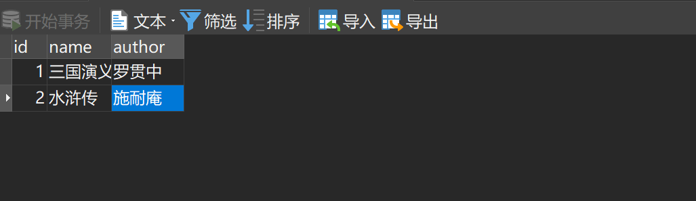

```
不要忘记给主键id设置自增，否则会抛出异常，
```

**创建项目，添加依赖**

创建spring boot项目，添加如下依赖：
```xml
		<dependency>
			<groupId>org.springframework.boot</groupId>
			<artifactId>spring-boot-starter-jdbc</artifactId>
		</dependency>
		<dependency>
			<groupId>org.springframework.boot</groupId>
			<artifactId>spring-boot-starter-web</artifactId>
		</dependency>
		<dependency>
			<groupId>mysql</groupId>
			<artifactId>mysql-connector-java</artifactId>
			<scope>runtime</scope>
		</dependency>
		<dependency>
			<groupId>com.alibaba</groupId>
			<artifactId>druid</artifactId>
			<version>1.1.9</version>
		</dependency>
```

spring-boot-starter-jdbc提供了spring-jdbc，另外还加入了数据库驱动依赖和数据库连接池依赖

**3.数据库配置**

在application.properties中配置数据库的基本连接信息

```
spring.datasource.type=com.alibaba.druid.pool.DruidDataSource
spring.datasource.url=jdbc:mysql://127.0.0.1:3306/JdbcTemplate
spring.datasource.username=root
spring.datasource.password=root
```

**4.创建实体类**
创建book实体类：
```java
    private Integer id;
    private String name;
    private String author;
    //省略getter/setter

    @Override
    public String toString() {
        return "Book{" +
                "id=" + id +
                ", name='" + name + '\'' +
                ", author='" + author + '\'' +
                '}';
    }

    public Integer getId() {
        return id;
    }

    public void setId(Integer id) {
        this.id = id;
    }

    public String getName() {
        return name;
    }

    public void setName(String name) {
        this.name = name;
    }

    public String getAuthor() {
        return author;
    }

    public void setAuthor(String author) {
        this.author = author;
    }
```

**5.创建数据库访问层**

创建BookDao：
```java
@Repository
public class BookDao {
    @Autowired
    JdbcTemplate jdbcTemplate;
    public int addBook(Book book) {
        return jdbcTemplate.update("INSERT INTO book(name,author) VALUES (?,?)",
                book.getName(), book.getAuthor());
    }
    public int updateBook(Book book) {
        return jdbcTemplate.update("UPDATE book SET name=?,author=? WHERE id=?",
                book.getName(), book.getAuthor(), book.getId());
    }
    public int deleteBookById(Integer id) {
        return jdbcTemplate.update("DELETE FROM book WHERE id=?", id);
    }
    public Book getBookById(Integer id) {
        return jdbcTemplate.queryForObject("select * from book where id=?",
                new BeanPropertyRowMapper<>(Book.class), id);
    }
    public List<Book> getAllBooks() {
        return jdbcTemplate.query("select * from book",
                new BeanPropertyRowMapper<>(Book.class));
    }
}
```

- 创建BookDao，注入JdbcTemplate，已经添加了spring-jdbc的相关依赖，所以直接注入JdbcTemplate使用
- 在JdbcTemplate中，增删改三中类型的操作主要是用update和batchUpdate方法来完成，query和queryForObject方法主要用来完成查询功能，另外还有execute可以用来执行任意的SQL，call方法用来调用存储过程。
- 在执行查询操作时，需要有一个RowMapper将查询出来的列和实体类中的属性一一对应起来，如果列名和属性名是相同的，那么可以直接使用BeanPropertyRowMapper；反之，则需要自己定义RowMapper接口，来将列和实体类属性一一对应起来。

**6.创建Service和Controller**
```java
// service.java
@Service
public class BookService {
    @Autowired
    BookDao bookDao;
    public int addBook(Book book) {
        return bookDao.addBook(book);
    }
    public int updateBook(Book book) {
        return bookDao.updateBook(book);
    }
    public int deleteBookById(Integer id) {
        return bookDao.deleteBookById(id);
    }
    public Book getBookById(Integer id) {
        return bookDao.getBookById(id);
    }
    public List<Book> getAllBooks() {
        return bookDao.getAllBooks();
    }
}
```
```java
// bookcontroller.java
@RestController
public class BookController {
    @Autowired
    BookService bookService;
    @GetMapping("/book")
    public void bookOps() {
        Book b1 = new Book();
        b1.setId(99);
        b1.setName("西厢记");
        b1.setAuthor("王实甫");
        int i = bookService.addBook(b1);
        System.out.println("addBook>>>" + i);
        Book b2 = new Book();
        b2.setId(1);
        b2.setName("朝花夕拾");
        b2.setAuthor("鲁迅");
        int updateBook = bookService.updateBook(b2);
        System.out.println("updateBook>>>"+updateBook);
        Book b3 = bookService.getBookById(1);
        System.out.println("getBookById>>>"+b3);
        int delete = bookService.deleteBookById(2);
        System.out.println("deleteBookById>>>"+delete);
        List<Book> allBooks = bookService.getAllBooks();
        System.out.println("getAllBooks>>>"+allBooks);
    }
}
```
最后在浏览器中访问http://localhost:8080/book，观察控制台输出。

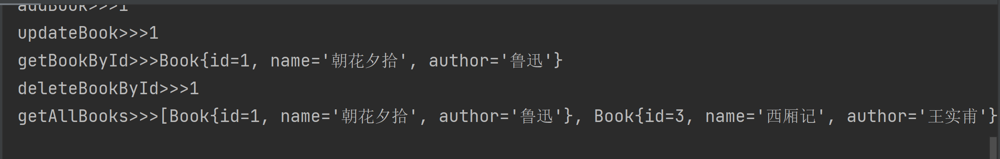

表中的数据也被更新了

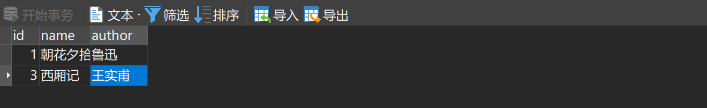

## 整合mybatis

mybatis是一款优秀的持久层框架，mybatis提供了一套开箱即用的自动化配置方案，可以做到mybatis开箱即用。

**1.创建项目**

创建spring boot项目，添加mybatis依赖、数据库驱动依赖，以及数据库连接池依赖。
```xml
		<dependency>
			<groupId>org.springframework.boot</groupId>
			<artifactId>spring-boot-starter-web</artifactId>
		</dependency>
		<dependency>
			<groupId>org.mybatis.spring.boot</groupId>
			<artifactId>mybatis-spring-boot-starter</artifactId>
			<version>1.3.2</version>
		</dependency>
		<dependency>
			<groupId>com.alibaba</groupId>
			<artifactId>druid</artifactId>
			<version>1.1.9</version>
		</dependency>
		<dependency>
			<groupId>mysql</groupId>
			<artifactId>mysql-connector-java</artifactId>
			<scope>runtime</scope>
		</dependency>
```

**2.创建数据库、表、实体类**

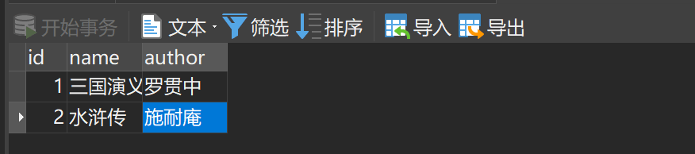

```java
// Book.java
public class Book {
    private Integer id;
    private String name;
    private String author;

    public Integer getId() {
        return id;
    }

    public void setId(Integer id) {
        this.id = id;
    }

    public String getName() {
        return name;
    }

    public void setName(String name) {
        this.name = name;
    }

    public String getAuthor() {
        return author;
    }

    public void setAuthor(String author) {
        this.author = author;
    }

    @Override
    public String toString() {
        return "Book{" +
                "id=" + id +
                ", name='" + name + '\'' +
                ", author='" + author + '\'' +
                '}';
    }
}
```

application.properties
```xml
spring.datasource.type=com.alibaba.druid.pool.DruidDataSource
spring.datasource.url=jdbc:mysql://127.0.0.1:3306/mybatis
spring.datasource.username=root
spring.datasource.password=root
```

**3.创建数据库访问层**

创建BookMapper：
```java
@Mapper
public interface BookMapper {
    int addBook(Book book);
    int deleteBookById(Integer id);
    int updateBookById(Book book);
    Book getBookById(Integer id);
    List<Book> getAllBooks();
}
```

- @Mapper注解指明类，或者在配置类上添加@MapperScan("com.exsample.exsample.mapper")注解，表示扫描com.exsample.exsample.mapper包下的所有接口作为Mapper

**4.创建BookMapper.xml**

在mapper包中创建BookMapper.xml文件
```xml
<?xml version="1.0" encoding="UTF-8" ?>
<!DOCTYPE mapper
        PUBLIC "-//mybatis.org//DTD Mapper 3.0//EN"
        "http://mybatis.org/dtd/mybatis-3-mapper.dtd">
<mapper namespace="com.example.mybatis.mapper.BookMapper">
    <insert id="addBook" parameterType="com.example.mybatis.model.Book">
        INSERT INTO mybatis(name,author) VALUES (#{name},#{author})
    </insert>
    <delete id="deleteBookById" parameterType="int">
        DELETE FROM mybatis WHERE id=#{id}
    </delete>
    <update id="updateBookById" parameterType="com.example.mybatis.model.Book">
        UPDATE mybatis set name=#{name},author=#{author} WHERE id=#{id}
    </update>
    <select id="getBookById" parameterType="int" resultType="org.sang.model.Book">
        SELECT * FROM mybatis WHERE id=#{id}
    </select>
    <select id="getAllBooks" resultType="com.example.mybatis.model.Book">
        SELECT * FROM mybatis
    </select>
</mapper>
```

- 针对BookMapper接口中的每一个方法都在BookMapper.xml中列出了实现
- #{}用来替代接口中的参数

**5.创建service、controller**
```java
// BookService.java
@Service
public class BookService {
    @Autowired
    BookMapper bookMapper;
    public int addBook(Book book) {
        return bookMapper.addBook(book);
    }
    public int updateBook(Book book) {
        return bookMapper.updateBookById(book);
    }
    public int deleteBookById(Integer id) {
        return bookMapper.deleteBookById(id);
    }
    public Book getBookById(Integer id) {
        return bookMapper.getBookById(id);
    }
    public List<Book> getAllBooks() {
        return bookMapper.getAllBooks();
    }
}
```
```java
// BookController.java
@RestController
public class BookController {
    @Autowired
    BookService bookService;
    @GetMapping("/book")
    public void bookOps() {
        Book b1 = new Book();
        b1.setName("西厢记");
        b1.setAuthor("王实甫");
        int i = bookService.addBook(b1);
        System.out.println("addBook>>>" + i);
        Book b2 = new Book();
        b2.setId(1);
        b2.setName("朝花夕拾");
        b2.setAuthor("鲁迅");
        int updateBook = bookService.updateBook(b2);
        System.out.println("updateBook>>>"+updateBook);
        Book b3 = bookService.getBookById(1);
        System.out.println("getBookById>>>"+b3);
        int delete = bookService.deleteBookById(2);
        System.out.println("deleteBookById>>>"+delete);
        List<Book> allBooks = bookService.getAllBooks();
        System.out.println("getAllBooks>>>"+allBooks);
    }
}
```
**6.配置pom.xml**
```xml
		<resources>
			<resource>
				<directory>src/main/java</directory>
				<includes>
					<include>**/*.xml</include>
				</includes>
			</resource>
			<resource>
				<directory>src/main/resources</directory>
			</resource>
		</resources>
```

最后在浏览器中访问http://localhost:8080/book，观察控制台输出。

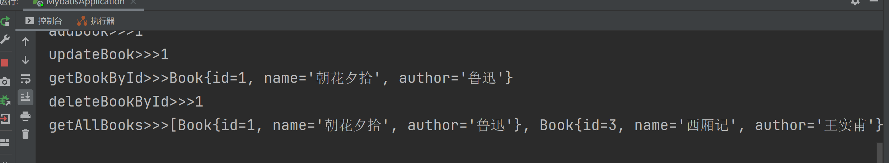

## 整合spring data JPA

JPA(java peisistence API)和spring data是两个范畴的概念

hibernante是一个ORM框架，JPA则是一种ORM框架规范，JPA和hibernante就像JDBC和JDBC驱动的关系。

spring data是spring的一个子项目，致力于简化数据库的访问，旨在减少数据库访问层的代码量。

spring boot整合spring data JPA步骤如下：

**1.创建数据库**

创建数据库jpa，不用创建表

**2.创建spring boot项目**

创建spring boot项目，添加mysql和spring data JPA的依赖：

```xml
<dependency>
            <groupId>org.springframework.boot</groupId>
            <artifactId>spring-boot-starter-data-jpa</artifactId>
        </dependency>
        <dependency>
            <groupId>org.springframework.boot</groupId>
            <artifactId>spring-boot-starter-web</artifactId>
        </dependency>
        <dependency>
            <groupId>com.alibaba</groupId>
            <artifactId>druid</artifactId>
            <version>1.1.9</version>
        </dependency>
        <dependency>
            <groupId>mysql</groupId>
            <artifactId>mysql-connector-java</artifactId>
            <scope>runtime</scope>
        </dependency>
```

**3.数据库配置**

在application.properties中配置数据库基本信息以及jpa相关配置。

```properties
//数据库基本配置
spring.datasource.type=com.alibaba.druid.pool.DruidDataSource
spring.datasource.url=jdbc:mysql://127.0.0.1:3306/jpa
spring.datasource.username=root
spring.datasource.password=root

//jpa相关配置

//是否在控制台打印jpa执行过程中生成的SQL
spring.jpa.show-sql=true

//jpa对应的数据库是mysql
spring.jpa.database=mysql

//在项目启动时根据实体类更新数据库中的表
spring.jpa.hibernate.ddl-auto=update

//使用的数据库方言是MySQL57Dialect
spring.jpa.properties.hibernate.dialect=org.hibernate.dialect.MySQL57Dialect
```

**4.创建实体类**

创建Book实体类：

```java
import javax.persistence.*;
@Entity(name = "t_book")
public class Book {
    @Id
    @GeneratedValue(strategy = GenerationType.IDENTITY)
    private Integer id;
    @Column(name = "book_name",nullable = false)
    private String name;
    private String author;
    private Float price;
    @Transient
    private String description;
    //省略getter/setter

    @Override
    public String toString() {
        return "Book{" +
                "id=" + id +
                ", name='" + name + '\'' +
                ", author='" + author + '\'' +
                ", price=" + price +
                ", description='" + description + '\'' +
                '}';
    }

    public String getDescription() {
        return description;
    }

    public void setDescription(String description) {
        this.description = description;
    }

    public Integer getId() {
        return id;
    }

    public void setId(Integer id) {
        this.id = id;
    }

    public String getName() {
        return name;
    }

    public void setName(String name) {
        this.name = name;
    }

    public String getAuthor() {
        return author;
    }

    public void setAuthor(String author) {
        this.author = author;
    }

    public Float getPrice() {
        return price;
    }

    public void setPrice(Float price) {
        this.price = price;
    }
}
```

- @Entity表示该类是一个实体类，在项目启动的时候会根据该类自动生成一张表，表名为name的值。
- @Id表示主键，@GeneratedValue表示主键自动生成，strategy表示主键生成的策略
- @Column注解可以定制生成字段的属性，name是对应数据表中字段的名称，nullable表示该字段非空
- @Transient生成数据库中的表时，该属性被忽略即不生成对应的字段

**5.创建BookDao接口**

创建BookDao接口，继承JpaRepository：

```java
public interface BookDao extends JpaRepository<Book,Integer> {
    List<Book> getBooksByAuthorStartingWith(String author);
    List<Book> getBooksByPriceGreaterThan(Float price);
    @Query(value = "select * from t_book where id=(select max(id) from t_book)",nativeQuery = true)
    Book getMaxIdBook();
    @Query("select b from t_book b where b.id>:id and b.author=:author")
    List<Book> getBookByIdAndAuthor(@Param("author") String author, @Param("id") Integer id);
    @Query("select b from t_book b where b.id<?2 and b.name like %?1%")
    List<Book> getBooksByIdAndName(String name, Integer id);
}
```

- 自定义BookDao继承JpaRepository，JpaRepository提供了一些基本的数据操作方法，有基本的增删改查、分页查询、排序查询等

```
这里省略了一堆知识
```

**6.创建service**

创建BookService：

```java
@Service
public class BookService {
    @Autowired
    BookDao bookDao;
    // save将对象数据保存到数据库
    public void addBook(Book book) {
        bookDao.save(book);
    }
    // 分页查询
    public Page<Book> getBookByPage(Pageable pageable) {
        return bookDao.findAll(pageable);
    }
    public List<Book> getBooksByAuthorStartingWith(String author){
        return bookDao.getBooksByAuthorStartingWith(author);
    }
    public List<Book> getBooksByPriceGreaterThan(Float price){
        return bookDao.getBooksByPriceGreaterThan(price);
    }
    public Book getMaxIdBook(){
        return bookDao.getMaxIdBook();
    }
    public List<Book> getBookByIdAndAuthor(String author, Integer id){
        return bookDao.getBookByIdAndAuthor(author, id);
    }
    public List<Book> getBooksByIdAndName(String name, Integer id){
        return bookDao.getBooksByIdAndName(name, id);
    }
}
```

**7.创建BookController**

```java
@RestController
public class BookController {
    @Autowired
    BookService bookService;
    @GetMapping("/findAll")
    public void findAll() {
        PageRequest pageable = PageRequest.of(2, 3);
        Page<Book> page = bookService.getBookByPage(pageable);
        System.out.println("总页数:"+page.getTotalPages());
        System.out.println("总记录数:"+page.getTotalElements());
        System.out.println("查询结果:"+page.getContent());
        System.out.println("当前页数:"+(page.getNumber()+1));
        System.out.println("当前页记录数:"+page.getNumberOfElements());
        System.out.println("每页记录数:"+page.getSize());
    }
    @GetMapping("/search")
    public void search() {
        List<Book> bs1 = bookService.getBookByIdAndAuthor("鲁迅", 7);
        List<Book> bs2 = bookService.getBooksByAuthorStartingWith("吴");
        List<Book> bs3 = bookService.getBooksByIdAndName("西", 8);
        List<Book> bs4 = bookService.getBooksByPriceGreaterThan(30F);
        Book b = bookService.getMaxIdBook();
        System.out.println("bs1:"+bs1);
        System.out.println("bs2:"+bs2);
        System.out.println("bs3:"+bs3);
        System.out.println("bs4:"+bs4);
        System.out.println("b:"+b);
    }
    @GetMapping("/save")
    public void save() {
        Book book = new Book();
        book.setAuthor("鲁迅");
        book.setName("呐喊");
        book.setPrice(23F);
        bookService.addBook(book);
    }
}
```

**8.测试**

1. 创建测试数据进行测试

访问http://localhost:8080/findAll

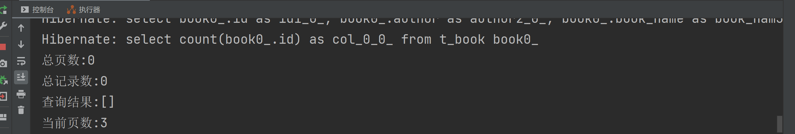

```
没有弄测试数据！！！
```

## 多数据源

多数据源就是一个javaEE项目中采用了不同的数据库实例中的多个库，或者是同一个数据库实例中多个不同的库

### JdbcTemplate多数据源

**1.创建数据库**

创建两个数据库，并且创建两个book表

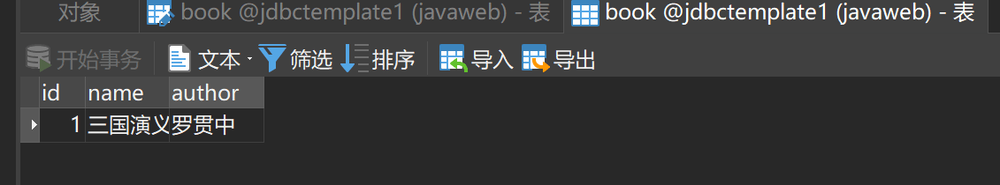

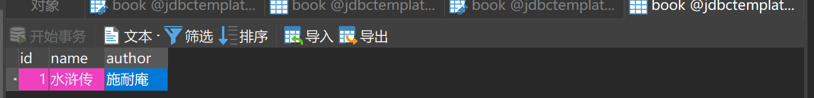

**2.创建项目**

创建spring boot项目，添加依赖：

```xml
        <dependency>
            <groupId>org.springframework.boot</groupId>
            <artifactId>spring-boot-starter-jdbc</artifactId>
        </dependency>
        <dependency>
            <groupId>org.springframework.boot</groupId>
            <artifactId>spring-boot-starter-web</artifactId>
        </dependency>
        <dependency>
            <groupId>com.alibaba</groupId>
            <artifactId>druid-spring-boot-starter</artifactId>
            <version>1.1.10</version>
        </dependency>
        <dependency>
            <groupId>mysql</groupId>
            <artifactId>mysql-connector-java</artifactId>
            <scope>runtime</scope>
        </dependency>
```

**3.配置数据库连接**

```properties
# 数据源1
spring.datasource.one.type=com.alibaba.druid.pool.DruidDataSource
spring.datasource.one.username=root
spring.datasource.one.password=root
spring.datasource.one.url=jdbc:mysql://127.0.0.1:3306/jdbctemplate1
# 数据源2
spring.datasource.two.type=com.alibaba.druid.pool.DruidDataSource
spring.datasource.two.username=root
spring.datasource.two.password=root
spring.datasource.two.url=jdbc:mysql://127.0.0.1:3306/jdbctemplate2
```

**4.配置数据源**


DataSourceConfig.java,根据application.properties中的配置生成两个数据源
```java
@Configuration
public class DataSourceConfig {
    @Bean
    @ConfigurationProperties("spring.datasource.one")
    DataSource dsOne() {
        return DruidDataSourceBuilder.create().build();
    }
    @Bean
    @ConfigurationProperties("spring.datasource.two")
    DataSource dsTwo() {
        return DruidDataSourceBuilder.create().build();
    }
}
```

- @ConfigurationProperties注解表示使用不同前缀的配置文件来创建不同的datasource

**5.配置JdbcTemplate**

JdbcTemplateConfig.java
```java
@Configuration
public class JdbcTemplateConfig {
    @Bean
    JdbcTemplate jdbcTemplateOne(@Qualifier("dsOne") DataSource dataSource) {
        return new JdbcTemplate(dataSource);
    }
    @Bean
    JdbcTemplate jdbcTemplateTwo(@Qualifier("dsTwo") DataSource dataSource) {
        return new JdbcTemplate(dataSource);
    }
}
```

- @Qualifier注解表示查找不同名称的datasource实例植入进来

**6.创建book、bookcontroller**

Book.java
```java
public class Book {
    private Integer id;
    private String name;
    private String author;

    @Override
    public String toString() {
        return "Book{" +
                "id=" + id +
                ", name='" + name + '\'' +
                ", author='" + author + '\'' +
                '}';
    }

    public Integer getId() {
        return id;
    }

    public void setId(Integer id) {
        this.id = id;
    }

    public String getName() {
        return name;
    }

    public void setName(String name) {
        this.name = name;
    }

    public String getAuthor() {
        return author;
    }

    public void setAuthor(String author) {
        this.author = author;
    }
}
```

BookController.java
```java
@RestController
public class BookController {
    @Resource(name = "jdbcTemplateOne")
//    @Autowired
    JdbcTemplate jdbcTemplate;
    @Autowired
    @Qualifier("jdbcTemplateTwo")
    JdbcTemplate jdbcTemplateTwo;
    @GetMapping("/test1")
    public void test1() {
        List<Book> books1 = jdbcTemplate.query("select * from book",
                new BeanPropertyRowMapper<>(Book.class));
        List<Book> books2 = jdbcTemplateTwo.query("select * from book",
                new BeanPropertyRowMapper<>(Book.class));
        System.out.println("books1:"+books1);
        System.out.println("books2:"+books2);
    }
}
```

**7.测试**

浏览器输入http://localhost:8080/test1

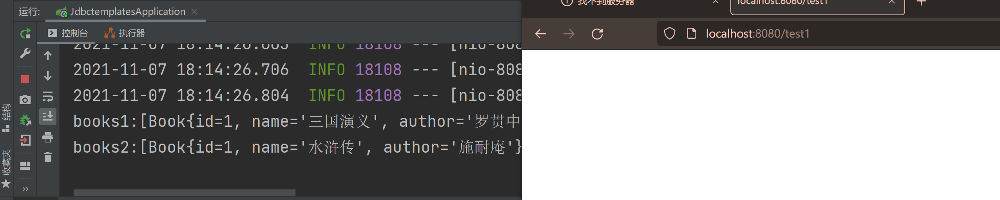

## mybatis多数据源

**1.创建数据库**

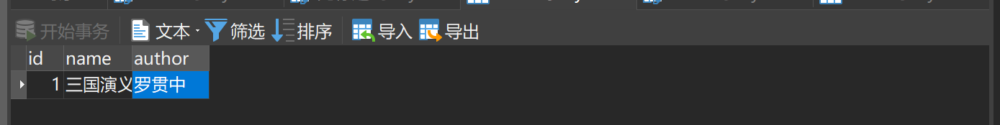

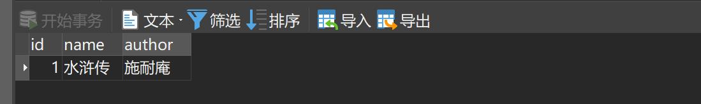

application.properties
```properties
spring.datasource.one.type=com.alibaba.druid.pool.DruidDataSource
spring.datasource.one.username=root
spring.datasource.one.password=root
spring.datasource.one.url=jdbc:mysql://127.0.0.1:3306/mybatis1

spring.datasource.two.type=com.alibaba.druid.pool.DruidDataSource
spring.datasource.two.username=root
spring.datasource.two.password=root
spring.datasource.two.url=jdbc:mysql://127.0.0.1:3306/mybatis2
```

**2.创建项目**

创建spring boot项目，添加依赖

```xml
        <dependency>
            <groupId>org.springframework.boot</groupId>
            <artifactId>spring-boot-starter-web</artifactId>
        </dependency>
        <dependency>
            <groupId>org.mybatis.spring.boot</groupId>
            <artifactId>mybatis-spring-boot-starter</artifactId>
            <version>1.3.2</version>
        </dependency>
        <dependency>
            <groupId>com.alibaba</groupId>
            <artifactId>druid-spring-boot-starter</artifactId>
            <version>1.1.10</version>
        </dependency>
        <dependency>
            <groupId>mysql</groupId>
            <artifactId>mysql-connector-java</artifactId>
            <scope>runtime</scope>
        </dependency>
```

```xml
        <resources>
            <resource>
                <directory>src/main/java</directory>
                <includes>
                    <include>**/*.xml</include>
                </includes>
            </resource>
            <resource>
                <directory>src/main/java</directory>
            </resource>
        </resources>
```

**3.创建mybatis配置**

提供两个DataSource
```java
// DataSourceConfig.java
@Configuration
public class DataSourceConfig {
    @Bean
    @ConfigurationProperties("spring.datasource.one")
    DataSource dsOne() {
        return DruidDataSourceBuilder.create().build();
    }
    @Bean
    @ConfigurationProperties("spring.datasource.two")
    DataSource dsTwo() {
        return DruidDataSourceBuilder.create().build();
    }
}
```
```java
// MyBatisConfigOne.java
@Configuration //指明该类是一个配置类
@MapperScan(value = "com.example.mutilbatis1.mapper1", sqlSessionFactoryRef = "sqlSessionFactoryBean1") //配置类中需要扫描的包com.example.mutilbatis1.mapper1
public class MyBatisConfigOne {
    @Autowired
    @Qualifier("dsOne")
    DataSource dsOne;

    @Bean
    SqlSessionFactory sqlSessionFactoryBean1() throws Exception {
        SqlSessionFactoryBean factoryBean = new SqlSessionFactoryBean();
        factoryBean.setDataSource(dsOne);
        return factoryBean.getObject();
    }
    @Bean
    SqlSessionTemplate sqlSessionTemplate1() throws Exception {
        return new SqlSessionTemplate(sqlSessionFactoryBean1());
    }
}
```
```java
// MyBatisConfigTwo.java
@Configuration
@MapperScan(value = "com.example.mutilbatis1.mapper2", sqlSessionFactoryRef = "sqlSessionFactoryBean2")
public class MyBatisConfigTwo {
    @Autowired
    @Qualifier("dsTwo")
    DataSource dsTwo;
    @Bean
    SqlSessionFactory sqlSessionFactoryBean2() throws Exception {
        SqlSessionFactoryBean factoryBean = new SqlSessionFactoryBean();
        factoryBean.setDataSource(dsTwo);
        return factoryBean.getObject();
    }
    @Bean
    SqlSessionTemplate sqlSessionTemplate2() throws Exception {
        return new SqlSessionTemplate(sqlSessionFactoryBean2());
    }
}
```

**4.mapper创建**
```java
@Component
public interface BookMapper {
    List<Book> getAllBooks();
}
```
```xml
<?xml version="1.0" encoding="UTF-8" ?>
<!DOCTYPE mapper
        PUBLIC "-//mybatis.org//DTD Mapper 3.0//EN"
        "http://mybatis.org/dtd/mybatis-3-mapper.dtd">
<mapper namespace="com.example.mutilbatis1.mapper1.BookMapper">
    <select id="getAllBooks" resultType="com.example.mutilbatis1.model.Book">
        select * from book;
    </select>
</mapper>
```

mapper2中的配置和mapper1中的配置差不多，参照实例

**5.创建controller**
```java
@RestController
public class BookController {
    @Autowired
    BookMapper bookMapper;
    @Autowired
    BookMapper2 bookMapper2;
    @GetMapping("/test1")
    public void test1() {
        List<Book> books1 = bookMapper.getAllBooks();
        List<Book> books2 = bookMapper2.getAllBooks();
        System.out.println("books1:"+books1);
        System.out.println("books2:"+books2);
    }
}
```

**6.测试**

浏览器输入localhost:8080/test1


## jpa多数据源

整合Jpa多数据源具体步骤如下：

**1.创建项目**

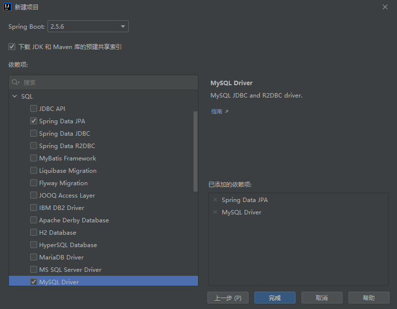

添加druid依赖：

```xml
        <dependency>
            <groupId>com.alibaba</groupId>
            <artifactId>druid-spring-boot-starter</artifactId>
            <version>1.1.10</version>
        </dependency>
```

**2.基本配置**

application.properties：
```properties
spring.datasource.one.type=com.alibaba.druid.pool.DruidDataSource
spring.datasource.one.username=root
spring.datasource.one.password=root
spring.datasource.one.url=jdbc:mysql://127.0.0.1:3306/jpa1

# 数据源2
spring.datasource.two.type=com.alibaba.druid.pool.DruidDataSource
spring.datasource.two.username=root
spring.datasource.two.password=root
spring.datasource.two.url=jdbc:mysql://127.0.0.1:3306/jpa2

#jpa配置
spring.jpa.properties.database=mysql
spring.jpa.properties.show-sql=true
spring.jpa.properties.database-platform=mysql
spring.jpa.properties.hibernate.ddl-auto=update
spring.jpa.properties.hibernate.dialect=org.hibernate.dialect.MySQL57Dialect
```

DataSource:
```java
@Configuration
public class DataSourceConfig {
    @Bean
    @ConfigurationProperties(prefix = "spring.datasource.one")
    @Primary
    DataSource dsOne() {
        return DruidDataSourceBuilder.create().build();
    }
    @Bean
    @ConfigurationProperties(prefix = "spring.datasource.two")
    DataSource dsTwo() {
        return DruidDataSourceBuilder.create().build();
    }
}
```

- @Primary表示当某一个类存在多个实例时，优先使用哪个实例。

**3.多数据源配置**

```java
@Configuration
@EnableTransactionManagement
@EnableJpaRepositories(basePackages = "com.example.mutiljpa.dao1",
        entityManagerFactoryRef = "entityManagerFactoryBeanOne",
        transactionManagerRef = "platformTransactionManagerOne")
public class JpaConfigOne {
    @Resource(name = "dsOne")
    DataSource dsOne;
    @Autowired
    JpaProperties jpaProperties;
    @Bean
    @Primary
    LocalContainerEntityManagerFactoryBean entityManagerFactoryBeanOne(
            EntityManagerFactoryBuilder builder) {
        return builder.dataSource(dsOne)
                .properties(jpaProperties.getProperties())
                .packages("com.example.mutiljpa.model")
                .persistenceUnit("pu1")
                .build();
    }
    @Bean
    PlatformTransactionManager platformTransactionManagerOne(
            EntityManagerFactoryBuilder builder) {
        LocalContainerEntityManagerFactoryBean factoryOne = entityManagerFactoryBeanOne(builder);
        return new JpaTransactionManager(factoryOne.getObject());
    }
}
```

- 这里注入dsOne，再注入JpaProperties，JpaProperties是系统提供的一个实例，里边的数据就是我们在application.properties中配置的jpa相关的配置。然后我们提供两个Bean，分别是LocalContainerEntityManagerFactoryBean和PlatformTransactionManager事务管理器，不同于MyBatis和JdbcTemplate，在Jpa中，事务一定要配置。在提供LocalContainerEntityManagerFactoryBean的时候，需要指定packages，这里的packages指定的包就是这个数据源对应的实体类所在的位置，另外在这里配置类上通过@EnableJpaRepositories注解指定dao所在的位置，以及LocalContainerEntityManagerFactoryBean和PlatformTransactionManager分别对应的引用的名字。

第二个基本类似
```java
@Configuration
@EnableTransactionManagement
@EnableJpaRepositories(basePackages = "com.example.mutiljpa.dao2",
        entityManagerFactoryRef = "entityManagerFactoryBeanTwo",
        transactionManagerRef = "platformTransactionManagerTwo")
public class JpaConfigTwo {
    @Resource(name = "dsTwo")
    DataSource dsTwo;
    @Autowired
    JpaProperties jpaProperties;
    @Bean
    LocalContainerEntityManagerFactoryBean entityManagerFactoryBeanTwo(
            EntityManagerFactoryBuilder builder) {
        return builder.dataSource(dsTwo)
                .properties(jpaProperties.getProperties())
                .packages("com.example.mutiljpa.model")
                .persistenceUnit("pu2")
                .build();
    }
    @Bean
    PlatformTransactionManager platformTransactionManagerTwo(
            EntityManagerFactoryBuilder builder) {
        LocalContainerEntityManagerFactoryBean factoryTwo = entityManagerFactoryBeanTwo(builder);
        return new JpaTransactionManager(factoryTwo.getObject());
    }
}
```

在对应位置分别提供相关的实体类和dao即可

```java
public interface UserDao extends JpaRepository<User,Integer> {
}
```

```java
public interface UserDao2 extends JpaRepository<User,Integer> {
}
```

实体类User.java
```java
@Entity(name = "t_user")
public class User {
    @Id
    @GeneratedValue(strategy = GenerationType.IDENTITY)
    private Integer id;
    private String name;
    private String gender;
    private Integer age;
    //省略getter/setter

    @Override
    public String toString() {
        return "User{" +
                "id=" + id +
                ", name='" + name + '\'' +
                ", gender='" + gender + '\'' +
                ", age=" + age +
                '}';
    }

    public Integer getId() {
        return id;
    }

    public void setId(Integer id) {
        this.id = id;
    }

    public String getName() {
        return name;
    }

    public void setName(String name) {
        this.name = name;
    }

    public String getGender() {
        return gender;
    }

    public void setGender(String gender) {
        this.gender = gender;
    }

    public Integer getAge() {
        return age;
    }

    public void setAge(Integer age) {
        this.age = age;
    }
}
```

**4.controller**

```java
@RestController
public class UserController {
    @Autowired
    UserDao userDao;
    @Autowired
    UserDao2 userDao2;
    @GetMapping("/test1")
    public void test1() {
        User u1 = new User();
        u1.setAge(55);
        u1.setName("鲁迅");
        u1.setGender("男");
        userDao.save(u1);
        User u2 = new User();
        u2.setAge(80);
        u2.setName("泰戈尔");
        u2.setGender("男");
        userDao2.save(u2);
    }
}
```

**5.测试**

在浏览器输入http://localhost:8080/test1

数据库中t_user中字段更新

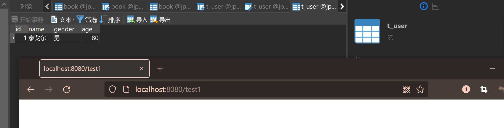


