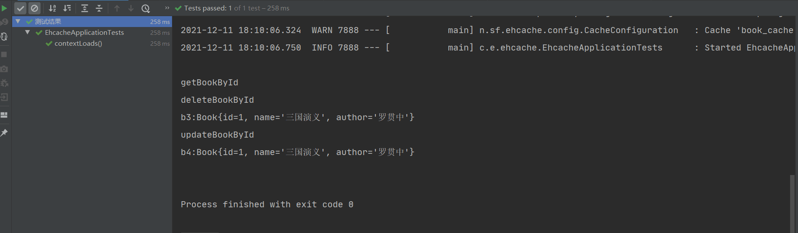

[toc]
---

# spring boot缓存

## Ehcache 2.x缓存

在spring boot中，只需要一个配置文件就可以将Ehcache缓存集成到项目中。

**1.新建项目，添加缓存依赖**

添加spring-boot-starter-cache以及ehcache依赖
```xml
        <dependency>
            <groupId>org.springframework.boot</groupId>
            <artifactId>spring-boot-starter-cache</artifactId>
        </dependency>
        <dependency>
            <groupId>org.springframework.boot</groupId>
            <artifactId>spring-boot-starter-web</artifactId>
        </dependency>
        <dependency>
            <groupId>net.sf.ehcache</groupId>
            <artifactId>ehcache</artifactId>
        </dependency>
        <dependency>
```

**2.添加缓存配置文件**

如果ehcache依赖存在，并且在classpath下有一个名为ehcache.xml的ehcache配置文件，那么，EhcacheCacheManger将自动作为缓存的实现。

所以在resources目录下创建ehcache.xml文件作为缓存的配置文件。

```xml
<ehcache>
    <diskStore path="java.io.tmpdir/cache"/>
    <defaultCache
            maxElementsInMemory="10000"
            eternal="false"
            timeToIdleSeconds="120"
            timeToLiveSeconds="120"
            overflowToDisk="false"
            diskPersistent="false"
            diskExpiryThreadIntervalSeconds="120"
    />
    <cache name="book_cache"
           maxElementsInMemory="10000"
           eternal="true"
           timeToIdleSeconds="120"
           timeToLiveSeconds="120"
           overflowToDisk="true"
           diskPersistent="true"
           diskExpiryThreadIntervalSeconds="10"/>
</ehcache>
```

在这个常规的ehcache配置文件中，提供了两个缓存策略：一个是默认的，一个是book_cache

- name:缓存名称
- maxElementsInMemory：缓存最大个数
- eternal：缓存对象是否永久有效，设置了永久有效之后，timeout将不起作用
- timeToIdleSeconds：缓存对象在失效前允许闲置的时间
- timeToLiveSeconds：缓存对象在失效前允许存活的时间，秒
- overflowToDisk：当内存中的对象数量达到maxElementsInMemory时，ehcache是否将对象写到磁盘中
- diskExpiryThreadIntervalSeconds：磁盘失效线程运行时间间隔

如果想自定义ehcache配置文件的名称和位置，可以再application.properties中配置：

```properties
spring.cache.ehcache.config=classpath:ehcache2.xml
```
替换名称和路径即可。

**4.开启缓存**

在项目的入口类上添加注解@EnableCaching，开启缓存

```java
@EnableCaching
@SpringBootApplication
public class EhcacheApplication {

    public static void main(String[] args) {
        SpringApplication.run(EhcacheApplication.class, args);
    }
}
```

**5.创建BookDao**

Book.java:
```java
public class Book implements Serializable {
    private Integer id;
    private String name;
    private String author;

    @Override
    public String toString() {
        return "Book{" +
                "id=" + id +
                ", name='" + name + '\'' +
                ", author='" + author + '\'' +
                '}';
    }

    public Integer getId() {
        return id;
    }

    public void setId(Integer id) {
        this.id = id;
    }

    public String getName() {
        return name;
    }

    public void setName(String name) {
        this.name = name;
    }

    public String getAuthor() {
        return author;
    }

    public void setAuthor(String author) {
        this.author = author;
    }
}
```

BookDao.java
```java
@Service
@CacheConfig(cacheNames = "book_cache")
public class BookDao {
    @Cacheable(keyGenerator = "myKeyGenerator")
    public Book getBookById(Integer id){
        System.out.println("getBookById");
        Book book =new Book();
        book.setId(id);
        book.setName("三国演义");
        book.setAuthor("罗贯中");
        return book;
    }
    @CachePut(key="#book.id")
    public Book updateBookById(Integer id){
        System.out.println("updateBookById");
        Book book = new Book();
        book.setName("三国演义1");
        return book;
    }
    @CacheEvict(key="#id")
    public void deleteBookById(Integer id){
        System.out.println("deleteBookById");
    }
}
```

- BookDao中的@CacheConfig(cacheNames = "book_cache")注解，指明使用缓存的名字（可选，也可直接在@CaCheable注解中直接指明）
-  @Cacheable注解表示对该方法进行缓存，默认情况下，缓存的key是方法的参数，缓存的value是方法的返回值 
-  @CachePut(key="#book.id")、@CacheEvict(key="#id")自定义key

**5.创建测试类**

```java
@RunWith(SpringRunner.class)
@SpringBootTest

class EhcacheApplicationTests {
    @Autowired
    BookDao bookDao;
    @Test
    public void contextLoads() {
        bookDao.getBookById(1);
        bookDao.getBookById(1);
        bookDao.deleteBookById(1);
        Book b3 = bookDao.getBookById(1);
        System.out.println("b3:"+b3);
        Book b = new Book();
        b.setName("三国演义");
        b.setAuthor("罗贯中");
        b.setId(1);
        bookDao.updateBookById(b);
        Book b4 = bookDao.getBookById(1);
        System.out.println("b4:"+b4);
    }

}
```

执行方法，观察控制台输出：



1. 一开始执行了两个查询，但是查询方法只打印了一次，第二次使用了缓存
2. 接着执行删除方法，然后有执行查询，查询方法成功被执行，因为再删除方法中，缓存已经被删除
3. 接着执行更新方法，不仅更新了数据，也更新了缓存所以在最后的查询中查询方法的日志没有打印，说明该方法没有被执行，而是使用了缓存中的数据，缓存的数据已经被更新过了