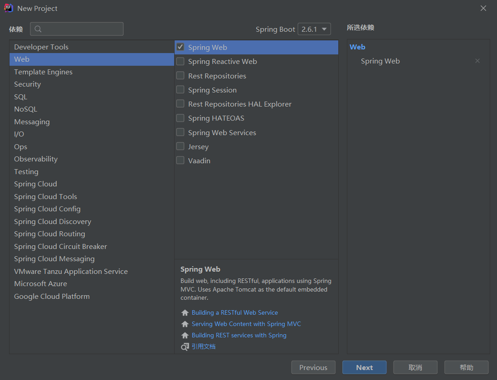
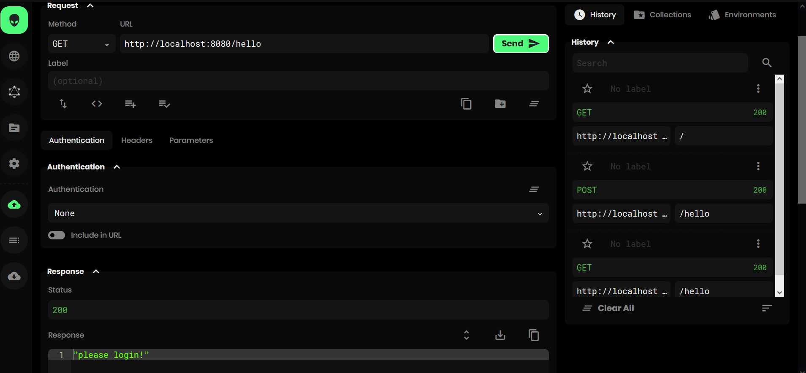
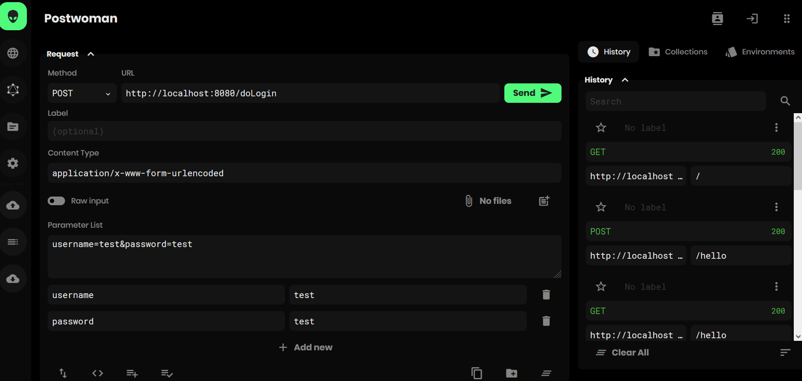
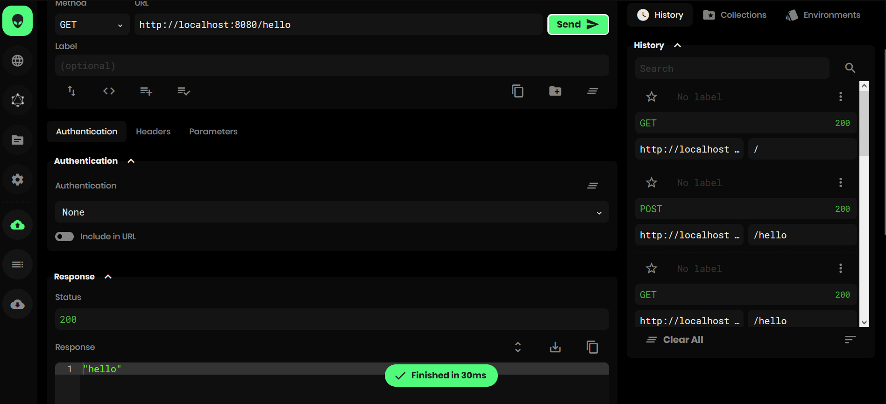

[toc]
---
# 安全管理

## spring boot整合shiro

在 Spring Boot 中做权限管理，一般来说，主流的方案是 Spring Security ，但是，仅仅从技术角度来说，也可以使用 Shiro。

**Spring Security&shiro**

1. Spring Security 是一个重量级的安全管理框架；Shiro 则是一个轻量级的安全管理框架
2. Spring Security 概念复杂，配置繁琐；Shiro 概念简单、配置简单
3. Spring Security 功能强大；Shiro 功能简单

### 原生的整合

**1.创建项目**

创建spring boot项目，添加web依赖



**2.加入shiro相关依赖**

```xml
        <dependency>
            <groupId>org.apache.shiro</groupId>
            <artifactId>shiro-web</artifactId>
            <version>1.4.0</version>
        </dependency>
        <dependency>
            <groupId>org.apache.shiro</groupId>
            <artifactId>shiro-spring</artifactId>
            <version>1.4.0</version>
        </dependency>
```

**3.创建realm**

在 Realm 中实现简单的认证操作，不做授权

一般情况，不会直接实现Realm接口，直接继承AuthorizingRealm，能够继承到认证与授权功能。（具体的Realm体系没整明白）它需要强制重写两个方法：

```java
public class MyRealm extends AuthorizingRealm {
    @Override
    protected AuthorizationInfo doGetAuthorizationInfo(PrincipalCollection principals) {
        return null;
    }
    @Override
    protected AuthenticationInfo doGetAuthenticationInfo(AuthenticationToken token) throws AuthenticationException {
        String username = (String) token.getPrincipal();
        if (!"test".equals(username)) {
            throw new UnknownAccountException("账户不存在!");
        }
        return new SimpleAuthenticationInfo(username, "test", getName());
    }
}
```
这里的认证表示用户名必须是 test ，用户密码必须是 test ，满足这样的条件，就能登录成功！

**3.配置shiro**

1. 首先需要提供一个 Realm 的实例。
2. 需要配置一个 SecurityManager，在 SecurityManager 中配置 Realm。
3. 配置一个 ShiroFilterFactoryBean ，在 ShiroFilterFactoryBean 中指定路径拦截规则等。
4. 配置登录和测试接口。

```java
@Configuration
public class ShiroConfig {
    @Bean
    MyRealm myRealm() {
        return new MyRealm();
    }

    @Bean
    SecurityManager securityManager() {
        DefaultWebSecurityManager manager = new DefaultWebSecurityManager();
        manager.setRealm(myRealm());
        return manager;
    }

    @Bean
    ShiroFilterFactoryBean shiroFilterFactoryBean() {
        ShiroFilterFactoryBean bean = new ShiroFilterFactoryBean();
        //指定 SecurityManager
        bean.setSecurityManager(securityManager());
        //登录页面
        bean.setLoginUrl("/login");
        //登录成功页面
        bean.setSuccessUrl("/index");
        //访问未获授权路径时跳转的页面
        bean.setUnauthorizedUrl("/unauthorizedurl");
        //配置路径拦截规则，注意，要有序
        Map<String, String> map = new LinkedHashMap<>();
        map.put("/doLogin", "anon");
        map.put("/**", "authc");
        bean.setFilterChainDefinitionMap(map);
        return bean;
    }
}
```

- setSecurityManager 表示指定 SecurityManager。
- etLoginUrl 表示指定登录页面。
- setSuccessUrl 表示指定登录成功页面。
- 接下来的 Map 中配置了路径拦截规则，注意，要有序。

**4.配置controller**

```java
@RestController
public class LoginController {
    @PostMapping("/doLogin")
    public void doLogin(String username, String password) {
        Subject subject = SecurityUtils.getSubject();
        try {
            subject.login(new UsernamePasswordToken(username, password));
            System.out.println("登录成功!");
        } catch (AuthenticationException e) {
            e.printStackTrace();
            System.out.println("登录失败!");
        }
    }
    @GetMapping("/hello")
    public String hello() {
        return "hello";
    }
    @GetMapping("/login")
    public String  login() {
        return "please login!";
    }
}
```

**5.测试**

首先访问 /hello 接口，由于未登录，所以会自动跳转到 /login 接口：



然后调用 /doLogin 接口完成登录：



访问/hello接口，成功




### Shiro Starter

创建工程，和上面的一样

添加依赖：

```xml
        <dependency>
            <groupId>org.springframework.boot</groupId>
            <artifactId>spring-boot-starter-web</artifactId>
        </dependency>

        <dependency>
            <groupId>org.apache.shiro</groupId>
            <artifactId>shiro-spring-boot-web-starter</artifactId>
            <version>1.4.0</version>
        </dependency>
```

realm和前面一样

配置shiro

在application.properties中配置shiro

```properties
shiro.sessionManager.sessionIdCookieEnabled=true
shiro.sessionManager.sessionIdUrlRewritingEnabled=true
shiro.unauthorizedUrl=/unauthorizedurl
shiro.web.enabled=true
shiro.successUrl=/index
shiro.loginUrl=/login
```

- 第一行表示是否允许将sessionId 放到 cookie 中
- 第二行表示是否允许将 sessionId 放到 Url 地址拦中
- 第三行表示访问未获授权的页面时，默认的跳转路径
- 第四行表示开启 shiro
- 第五行表示登录成功的跳转页面
- 第六行表示登录页面

配置shiroconfig

```java
@Configuration
public class ShiroConfig {
    @Bean
    MyRealm myRealm() {
        return new MyRealm();
    }

    @Bean
    DefaultWebSecurityManager securityManager() {
        DefaultWebSecurityManager manager = new DefaultWebSecurityManager();
        manager.setRealm(myRealm());
        return manager;
    }

    @Bean
    ShiroFilterChainDefinition shiroFilterChainDefinition() {
        DefaultShiroFilterChainDefinition definition = new DefaultShiroFilterChainDefinition();
        definition.addPathDefinition("/doLogin", "anon");
        definition.addPathDefinition("/**", "authc");
        return definition;
    }
}
```

Shiro 的配置主要配置 3 个 Bean 

1. 首先需要提供一个 Realm 的实例
2. 需要配置一个 SecurityManager，在 SecurityManager 中配置 Realm
3. 配置一个 ShiroFilterFactoryBean ，在 ShiroFilterFactoryBean 中指定路径拦截规则等

这里的配置和前面的比较像，但是不再需要 ShiroFilterFactoryBean 实例了，替代它的是 ShiroFilterChainDefinition ，在这里定义 Shiro 的路径匹配规则即可。

测试和上面一样