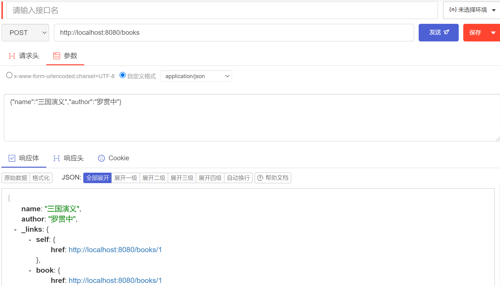
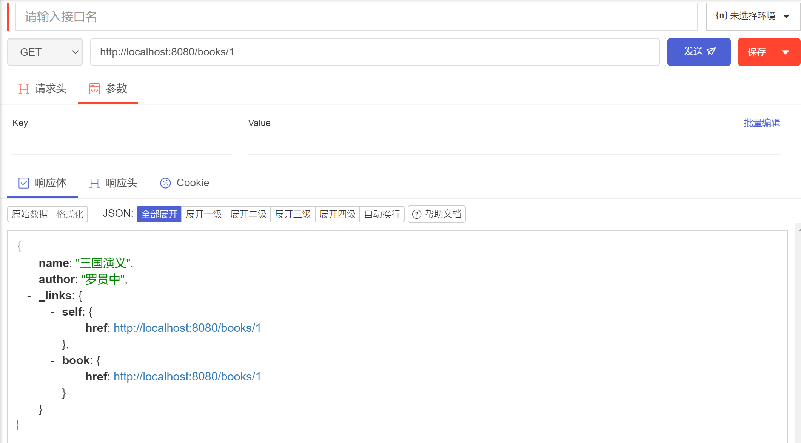

[toc]
---
# 构建restful服务

REST是一种web软件架构风格，匹配或兼容这种架构风格的网络服务称为REST服务，spring boot提供了自动化配置方案

**1.创建项目**

首先创建一个 Spring Boot 工程，引入 Web 、 Jpa 、 MySQL 、 RestRepositories 依赖

```xml
        <dependency>
            <groupId>org.springframework.boot</groupId>
            <artifactId>spring-boot-starter-data-jpa</artifactId>
        </dependency>
        <dependency>
            <groupId>org.springframework.boot</groupId>
            <artifactId>spring-boot-starter-data-rest</artifactId>
        </dependency>
        <dependency>
            <groupId>com.alibaba</groupId>
            <artifactId>druid-spring-boot-starter</artifactId>
            <version>1.1.10</version>>
        </dependency>
        <dependency>
            <groupId>mysql</groupId>
            <artifactId>mysql-connector-java</artifactId>
            <scope>runtime</scope>
        </dependency>
```

**2.配置数据库、jpa**

```properties
spring.datasource.type=com.alibaba.druid.pool.DruidDataSource
spring.datasource.url=jdbc:mysql://127.0.0.1:3306/jparestful
spring.datasource.username=root
spring.datasource.password=root
spring.datasource.driver-class-name=com.mysql.cj.jdbc.Driver
spring.jpa.hibernate.ddl-auto=update
spring.jpa.database=mysql
spring.jpa.properties.hibernate.dialect=org.hibernate.dialect.MySQL57Dialect
spring.jpa.show-sql=true
```

- 前面五行配置了数据库的基本信息，包括数据库连接池、数据库用户名、数据库密码、数据库连接地址以及数据库驱动名称。

- 接下来的五行配置了 JPA 的基本信息，分别表示生成 SQL 的方言、打印出生成的 SQL 、每次启动项目时根据实际情况选择是否更新表、数据库平台是 MySQL。

**3.构建实体类**

```java
@Entity(name = "t_book")
public class Book {
    @Id
    @GeneratedValue(strategy = GenerationType.IDENTITY)
    private Integer id;
    private String name;
    private String author;
    //省略getter/setter

    @Override
    public String toString() {
        return "Book{" +
                "id=" + id +
                ", name='" + name + '\'' +
                ", author='" + author + '\'' +
                '}';
    }

    public Integer getId() {
        return id;
    }

    public void setId(Integer id) {
        this.id = id;
    }

    public String getName() {
        return name;
    }

    public void setName(String name) {
        this.name = name;
    }

    public String getAuthor() {
        return author;
    }

    public void setAuthor(String author) {
        this.author = author;
    }
}
```
```java
public interface BookRepository extends JpaRepository<Book, Integer> {
}
```

- 这里一个是配置了一个实体类 Book，另一个则是配置了一个 BookRepository ，项目启动成功后，框架会根据 Book 类的定义，在数据库中自动创建相应的表，BookRepository 接口则是继承自 JpaRepository ，JpaRepository 中自带了一些基本的增删改查方法。

**4.测试**

启动项目，使用浏览器插件postman测试：

向数据库中添加一条数据：



查询测试：

更换请求为GET，http://localhost:8080/books/1




